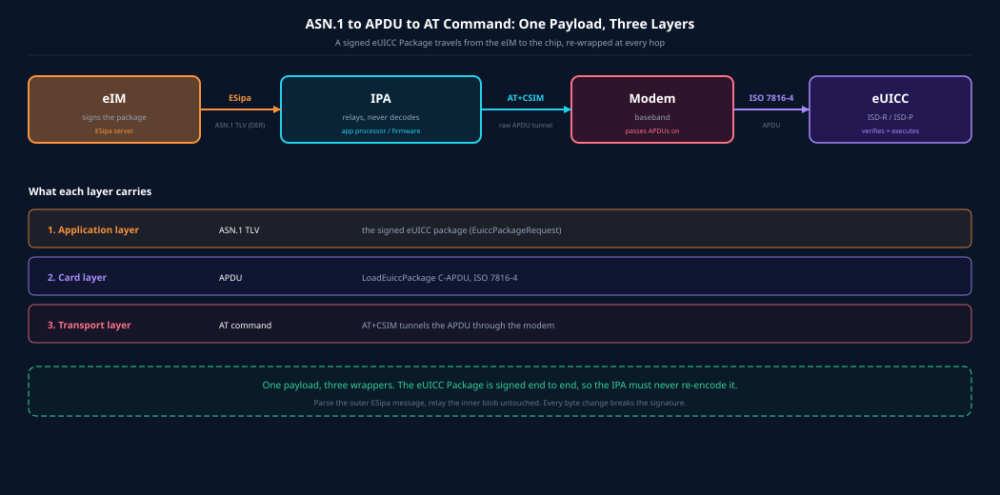

**[eUICC.tech]({{ site.baseurl }}/) > [Foundations]({{ site.baseurl }}/docs/articles/foundations/) > ASN.1 Tags, TLV, and APDUs**

# ASN.1 Tags, TLV, and APDUs: How eSIM Data Is Encoded and Delivered

> **Why this matters:** Every eSIM operation, from downloading a profile to enabling one remotely, is a conversation carried in bytes. If you understand how those bytes are built (a tag, a length, a value), the rest of the eSIM specifications stop feeling like magic.

> **Key takeaways:**
> - ASN.1 is a schema; DER is the canonical encoding used because messages are signed.
> - A tag packs three fields into one byte: class, primitive-or-constructed, and a number.
> - `0xBF...` is a context-specific constructed tag; the real number follows it.
> - Signed packages are opaque to the devices that relay them.
> - ASN.1 rides inside APDUs on the card interface, and APDUs ride inside AT commands when tunnelled through a modem.

## Why ASN.1 matters here

Remote SIM Provisioning (GSMA SGP.22, SGP.32) is a conversation between machines that has to be byte-exact and cryptographically verifiable. Two parties, the eIM or SM-DP+ and the eUICC chip, exchange messages like "enable this profile" or "add this operator configuration." Those messages must be encoded unambiguously so both ends agree on every byte, and encoded canonically so a digital signature over those bytes verifies the same way everywhere.

ASN.1 (Abstract Syntax Notation One, ISO/IEC 8824) is the notation used to declare those structures. The encoding rules (ISO/IEC 8825) turn the abstract structures into the bytes on the wire. In eSIM work you meet two of them:

- **BER** (Basic Encoding Rules) is the general, flexible encoding.
- **DER** (Distinguished Encoding Rules) is the canonical subset used whenever the bytes will be signed. DER removes every optional choice, so the same structure always produces the same bytes.

> **Why canonical matters:** the eIM signs the encoded package. The IPA and eUICC must treat that package as an opaque blob. If any layer re-encoded it, even "equivalently," the signature would break. DER is what makes "do not touch the bytes" enforceable.

## The TLV structure

Every ASN.1 value is encoded as a **Tag-Length-Value** triple, and the value may itself contain nested TLVs:

```
+-----------+--------------+-------------------------------+
|   TAG     |   LENGTH     |   VALUE                       |
| 1+ octets | 1+ octets    | (nested TLVs or raw bytes)    |
+-----------+--------------+-------------------------------+
```

The tag says what kind of value this is. The length says how many octets the value occupies. The value is the payload, recursively TLV-encoded when the tag is constructed.

## The tag octet, bit by bit

The first octet of a tag packs three fields:

```
  8   7   |   6   |  5   4   3   2   1      bit positions
+---------+-------+-----------------------+
|  class  |  P/C  |      tag number       |
+---------+-------+-----------------------+
```

**Class (bits 8-7):**

| Bits | Class             | Meaning                                |
|------|-------------------|----------------------------------------|
| `00` | Universal         | Built-in types (INTEGER, SEQUENCE, ...) |
| `01` | Application       | Defined per application standard       |
| `10` | Context-specific  | Defined per ASN.1 module (GSMA's choice) |
| `11` | Private           | Enterprise-specific                    |

**P/C (bit 6):**

| Bit | Meaning    | What the value is                    |
|-----|------------|--------------------------------------|
| `0` | Primitive  | A leaf, raw data, no nested TLVs     |
| `1` | Constructed| A container holding nested TLVs      |

**Tag number (bits 5-1):** values `0` to `30` encode directly. The value `31` (`11111`) is the escape hatch meaning high-tag-number form, where the real number follows in the next octets.

### Universal tags you will see constantly

| Type          | Hex   | Notes                          |
|---------------|-------|--------------------------------|
| INTEGER       | `02`  | primitive                      |
| OCTET STRING  | `04`  | primitive, raw bytes           |
| NULL          | `05`  | primitive                      |
| OID           | `06`  | primitive                      |
| SEQUENCE      | `30`  | constructed                    |
| SET           | `31`  | constructed                    |

SEQUENCE and SET are always constructed, which is why their universal tag is `0x30` and `0x31` rather than `0x10` and `0x11`.

## High-tag-number form (where 0xBF comes from)

When the tag number is 31 or greater, the five low bits are set to `11111` and the actual number is encoded base-128 in the following octets: seven bits of value each, with the high bit set on every octet except the last.

A tag beginning `0xBF` is therefore:

```
0xBF  =  1 0 1 1 1 1 1 1
         | | \________/
         | |     +-- tag number = 11111 (31)  -> "more follows"
         | +-------- P/C = 1 (constructed)
         +---------- class = 10 (context-specific)
```

So `0xBF` is a context-specific, constructed tag whose number is carried in the next octet.

### The `[80]` tag, decoded concretely

GSMA SGP.32 declares the eUICC package request as:

```asn1
EuiccPackageRequest ::= [80] SEQUENCE { ... }
```

`[80]` means context-specific tag number 80. Encoding it:

- 80 is 31 or more, so the first octet uses high-tag-number form: `10` (context) `1` (constructed) `11111` gives `1011 1111`, which is `0xBF`.
- 80 in one base-128 octet (80 is below 128): `0101 0000`, which is `0x50`.

```
[80] SEQUENCE  ->  tag octets:  BF 50
```

> **The common mistake:** `BF 51` is not `[80]`. `0x51` is 81, so `BF 51` decodes as context-specific constructed tag 81, and `BF 52` is tag 82. Confusing `[80]` (which is `BF 50`) with `BF 51` is an off-by-one on the tag number.

## Length encoding

The length octets follow the tag.

**Short form** (length below 128): a single octet with the high bit clear.

```
06              ->  length 6
7F              ->  length 127
```

**Long form** (length 128 or more): the first octet has the high bit set, and its low seven bits give how many length octets follow, in big-endian order.

```
81 C8           ->  one length octet follows, value 200
82 01 00        ->  two length octets follow, value 256
```

> `0x80` (indefinite length) exists in BER only. DER forbids it. Every DER value carries an explicit, definite length, which is part of why DER is deterministic and signature-safe.

## A worked example

Declare a minimal structure:

```asn1
MyMessage ::= [80] SEQUENCE {
    value  OCTET STRING
}
```

Set `value = DE AD BE EF` (four octets). Encode it by hand:

| Step | Bytes | Meaning |
|------|-------|---------|
| Tag `[80]`                   | `BF 50`         | context-specific, constructed, number 80 |
| Length of SEQUENCE content   | `06`            | six octets follow |
| Inner OCTET STRING tag       | `04`            | universal, primitive, number 4 |
| Inner length                 | `04`            | four octets |
| Inner value                  | `DE AD BE EF`   | the payload |

Full encoding:

```
BF 50 06 04 04 DE AD BE EF
```

Read it left to right: a context-specific `[80]` container of six bytes, holding an OCTET STRING of four bytes. Every ASN.1 message, however large, decomposes into exactly this kind of nested TLV tree.

## The SGP.32 structures

Four structures matter for IoT provisioning, with the correct tags:

```asn1
-- eIM -> eUICC (relayed by the IPA). Tag is [80], not 'BF51'.
EuiccPackageRequest ::= [80] SEQUENCE {
    euiccPackageRequestData CHOICE {
        psmoList                   SEQUENCE OF Psmo,   -- enable/disable/delete/rollback/setFallback
        ecoList                    SEQUENCE OF Eco,    -- add/delete/update/list eIM configuration
        euiccMemoryReset           ...,
        executeFallbackMechanism   ...
    },
    eimSignEpReq     OCTET STRING,          -- eIM's ECDSA signature
    eimCertificate   Certificate OPTIONAL,  -- eIM's signing certificate
    eimTransactionId TransactionId OPTIONAL -- correlates request to result
}

-- eUICC -> eIM (relayed by the IPA). A CHOICE, not a tagged SEQUENCE.
EuiccPackageResult ::= CHOICE {
    euiccPackageResultDataSigned SEQUENCE { psmoResultList, ecoResultList },
    euiccPackageErrorSigned      EuiccPackageError
}
```

The other two are ESipa-level messages, carried between the IPA and eIM over the network, not eUICC packages:

```asn1
-- Heartbeat: the eIM asks the IPA what is on the eUICC.
IpaEuiccDataRequest ::= SEQUENCE { tagList, eimTransactionId }

-- The eIM tells the IPA to fetch a profile.
ProfileDownloadTriggerRequest ::= SEQUENCE {
    activationCode | smdsEventRecord, eimTransactionId }
```

**The critical architectural point:** `EuiccPackageRequest` is opaque to the IPA. It is signed by the eIM. The IPA never decodes or re-encodes it. Its only job is to parse the outer ESipa message, extract the signed blob as raw bytes, and relay it to the eUICC. This is exactly why DER canonical encoding matters: any byte change breaks the signature.

For the full picture of these messages, see the [IoT eSIM Functions Reference]({{ site.baseurl }}/docs/articles/sgp32/16-iot-functions-reference) and [IoT Profile Download]({{ site.baseurl }}/docs/articles/sgp32/09-iot-profile-download-packages).

## ASN.1 to APDU: the card interface

The eUICC is a smart card. It speaks ISO/IEC 7816-4 in the form of APDUs (Application Protocol Data Units). A **command APDU (C-APDU)** is:

```
+------+------+--------+------+--------------+------+
| CLA  | INS  |  P1 P2 |  Lc  |    DATA      |  Le  |
+------+------+--------+------+--------------+------+
 class  instr   params   data  payload        expected
                       length  (ASN.1 TLV)    response len
```

A **response APDU (R-APDU)** returns `DATA + SW1 SW2`, where the status word tells you success or failure.

In SGP.32 the relevant ES10b function is **`LoadEuiccPackage`**: the `DATA` field is the ASN.1-encoded `EuiccPackageRequest`. If the package exceeds the card's negotiated APDU buffer (agreed during the card's Answer-To-Reset), the IPA fragments it across chained APDUs and the eUICC reassembles them before verifying the signature and running the operations. The result, also ASN.1, comes back in the R-APDU, and the IPA relays it to the eIM.

## APDU to AT command: the modem interface

AT commands do not speak ASN.1, and they do not talk to the eUICC. AT commands (3GPP TS 27.007) control the modem: attach, signal strength, PDP context, and so on.

They matter for eSIM only when the IPA runs on a separate application processor from the modem. In that case the eUICC is physically wired to the modem, so the application processor has no direct wire to the chip. It tunnels raw APDUs through the modem with one of two AT commands.

### AT+CSIM: generic SIM access

```
AT+CSIM=<length>,<hex APDU>
```

This passes a complete raw APDU through the modem to the UICC or eUICC and returns the response APDU. It is the general-purpose tunnel and can carry arbitrary eSIM and ES10 APDUs, which is why an IPAd hosted on a separate host CPU depends on it.

### AT+CRSM: restricted SIM access

```
AT+CRSM=<command>,<fileid>,<P1>,<P2>,<P3>[,<data>]
```

This only performs elementary-file operations (read, write, select on the SIM file tree). It is not sufficient for arbitrary eSIM APDUs, so it is not the tunnel used for `LoadEuiccPackage` or the ES10b extensions.

The whole path, from server to chip:



### The three-layer stack

```
 ASN.1 TLV    <- what the data MEANS    (EuiccPackageRequest, the signed PSMO)
     |
     v
 APDU         <- how the CARD hears it  (LoadEuiccPackage C-APDU)
     |
     v
 AT+CSIM      <- how the app CPU reaches the eUICC through the modem
```

When the IPAd is hosted inside the modem firmware, a common design, the AT-command layer disappears entirely. The baseband sends APDUs straight to the eUICC over its internal ISO 7816 interface, removing both the AT+CSIM tunnel and the serial-buffer bottleneck it imposes.

## End to end: enabling a profile

A single enable-profile PSMO, followed from eIM to eUICC and back:

1. The eIM builds `EuiccPackageRequest`, puts `enableProfile` in `psmoList`, signs it, and DER-encodes the whole structure.
2. The eIM sends it to the IPA over ESipa (HTTP or CoAP), inside a `TransferEimPackage` response.
3. The IPA parses the outer ESipa ASN.1, recognises `EuiccPackageRequest`, and treats it as opaque bytes.
4. The IPA sends it to the eUICC via ES10b `LoadEuiccPackage`, carried as APDU data, fragmented and chained if needed, and tunnelled through `AT+CSIM` when the IPA sits on a separate processor.
5. The eUICC verifies the signature against the eIM public key in its configuration, then runs the PSMO.
6. The eUICC returns a signed `EuiccPackageResult` in the R-APDU.
7. The IPA relays it to the eIM over ESipa via `ProvideEimPackageResult`.

## Summary

ASN.1 is a schema language, and DER is the canonical encoding used because eSIM messages are signed. Every value is a Tag-Length-Value triple. The tag packs class, primitive-or-constructed, and a number into a single octet, and `0xBF` is a context-specific constructed tag whose number follows in base-128 form. The eUICC package request is `[80] SEQUENCE`, which encodes as `BF 50`, not `BF 51`.

That signed package is opaque to every device that relays it. On the network side it rides inside ESipa messages; on the card side it rides inside APDUs (specifically `LoadEuiccPackage`); and when the IPA lives on a separate processor, those APDUs ride through the modem inside an `AT+CSIM` command. Three layers, one payload, and a signature that has to survive every hop untouched.

---

*Based on ISO/IEC 8824 and 8825 (ASN.1), ISO/IEC 7816-4 (APDUs), 3GPP TS 27.007 (AT commands), and GSMA SGP.22 and SGP.32.*

---

<div align="center">

← [Foundations]({{ site.baseurl }}/docs/articles/foundations/) · <a href="{{ site.baseurl }}/">Home</a><a href="{{ site.baseurl }}/docs/articles/">Specs</a>

Next: <a href="{{ site.baseurl }}/docs/articles/sgp32/16-iot-functions-reference">IoT eSIM Functions Reference: ESipa, ES9+', ES11', ESep</a> →

</div>
