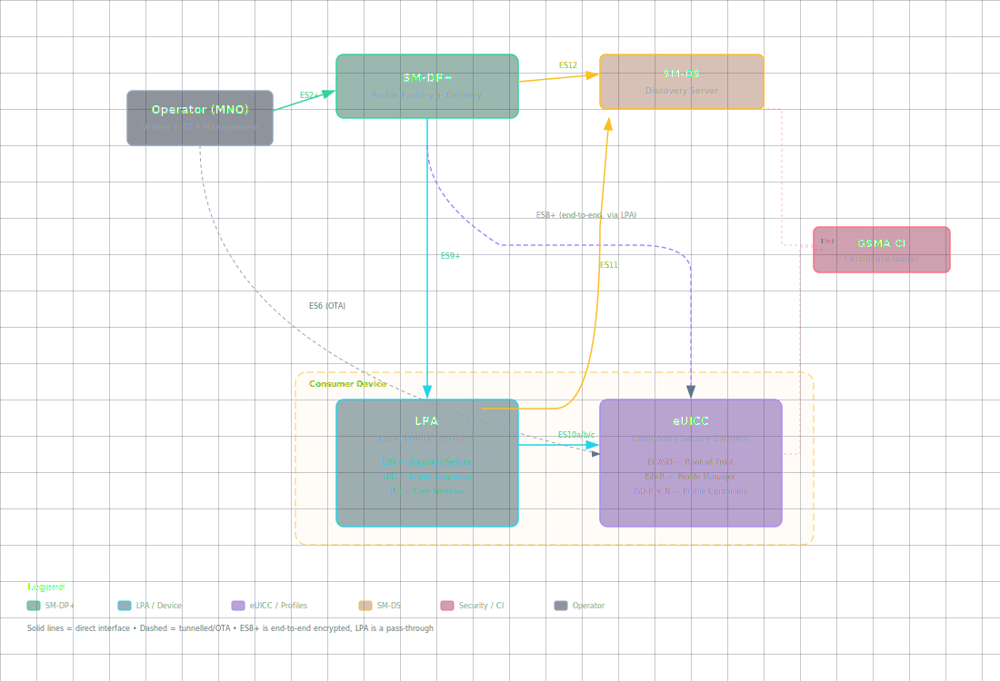

# eSIM Remote SIM Provisioning (RSP) : How It Works

**🏠 [eUICC.tech]({{ site.baseurl }}/) > [SGP.22 Consumer RSP]({{ site.baseurl }}/docs/articles/sgp22/) > eSIM Remote SIM Provisioning (RSP) : How It Works**

> **📚 Prerequisites:** New to telecom or smart card technology? Read our [Prerequisites Guide]({{ site.baseurl }}/docs/prerequisites) first. The [Glossary]({{ site.baseurl }}/docs/glossary) defines all acronyms used in these articles.

> **💡 Why this matters:** SGP.22 is the protocol behind every eSIM download, carrier switch, and multi-profile device on the planet. Understanding it gives you the foundation for everything from consumer eSIM UX to industrial IoT provisioning.

> **Key takeaways:**
> - RSP lets you securely download operator credentials over the internet into a chip manufactured months earlier by a different company
> - The system has five players (eUICC, SM-DP+, SM-DS, LPA, Operator) and thirteen interfaces between them
> - A profile is delivered in three phases: initiation, mutual authentication, and encrypted download
> - Security relies on a GSMA-rooted PKI with chip-level isolation and forward secrecy
> - The LPA is an untrusted pass-through: all cryptographic verification happens on the eUICC itself

---

## What is RSP?

**Remote SIM Provisioning** (RSP) is the technology that lets you download a mobile plan directly to your device without inserting a physical SIM card. The GSMA specification **SGP.22** defines exactly how this works for consumer devices: phones, tablets, wearables, and laptops.

SGP.22 solves one problem: **how do you securely deliver a mobile operator's credentials over the internet into a chip that was manufactured months earlier by someone else?**

---

## The Architecture

SGP.22 defines a system with five key players and thirteen interfaces between them.

### The Players

**eUICC (embedded UICC)** : The chip. A tamper-resistant secure element soldered into the device (or removable in some implementations). It runs a Java Card operating system and hosts multiple isolated "Profiles," each containing one operator's credentials. Think of it as a vault with multiple locked rooms.

**SM-DP+ (Subscription Manager: Data Preparation)** : The profile factory. This is the server operated by the operator or a third party that builds, encrypts, and delivers Profiles to eUICCs. It generates the cryptographic binding that ties a specific profile to a specific chip.

**SM-DS (Subscription Manager: Discovery Server)** : The notification service. When an SM-DP+ has a Profile waiting for your eUICC, it registers an "Event" on the SM-DS. Your device polls the SM-DS periodically to check if there's a profile waiting. The SM-DS doesn't hold profiles: just pointers.

**LPA (Local Profile Assistant)** : The on-device manager. This is the software component that orchestrates everything on the device side. It has three sub-components:
- **LDS** (Local Discovery Service) : polls the SM-DS for pending profiles
- **LPD** (Local Profile Download) : handles the actual download and delivery to the eUICC
- **LUI** (Local User Interface) : the screen the user sees to switch, add, or delete profiles

**Operator (MNO)** : The mobile network operator. Orders profiles from the SM-DP+, manages its profiles post-install via OTA (Over-The-Air), and handles the business relationship with the end user.

### The Interfaces at a Glance

| Interface | Between | What It Does |
|-----------|---------|-------------|
| `ES2+` | Operator → SM-DP+ | Profile ordering and lifecycle |
| `ES8+` | SM-DP+ → eUICC | Secure end-to-end channel for profile installation |
| `ES9+` | SM-DP+ → LPA (LPD) | Secure transport for the bound profile package |
| `ES10a` | LPA (LDS) → eUICC | Profile discovery queries |
| `ES10b` | LPA (LPD) → eUICC | Profile transfer and authentication |
| `ES10c` | LPA (LUI) → eUICC | Local profile management (enable, disable, delete) |
| `ES11` | LPA (LDS) → SM-DS | Event retrieval |
| `ES12` | SM-DP+ → SM-DS | Event registration and deletion |
| `ES6` | Operator → eUICC | Post-install OTA management |
| `ES15` | SM-DS → SM-DS | Cascading between discovery servers |

---

## Inside the eUICC

The eUICC is not just storage: it's an active secure platform with a defined internal architecture.

### ECASD (eUICC Controlling Authority Security Domain)

The root of trust. Installed at the factory by the **EUM** (eUICC Manufacturer), it holds:
- The eUICC's unique private key and certificate
- The GSMA Certificate Issuer's public keys (to verify SM-DP+ and SM-DS certificates)
- The EUM's certificate (proving the chip is genuine)

The ECASD is never deleted and cannot be modified after manufacturing.

### ISD-R (Issuer Security Domain: Root)

The profile manager. One per eUICC. It creates **ISD-Ps** (profile containers), manages their lifecycle, and provides services to the LPA. The `ISD-R` is the gatekeeper: nothing happens to a profile without it.

### ISD-P (Issuer Security Domain: Profile)

The profile container. Each holds exactly one Profile. ISD-Ps are cryptographically isolated from each other: a profile in one ISD-P cannot see or access anything in another ISD-P. When you delete a profile, the ISD-P and everything inside it is destroyed.

### The Profile

A fully functional operator subscription, containing:
- **MNO-SD** : the operator's on-card representative with OTA keys
- **NAAs** (Network Access Applications) : the USIM, ISIM, or CSIM that authenticates to the network
- **File System** : phonebook, SMS storage, network parameters
- **Applets & SSDs** : payment apps, secure elements, NFC applications
- **Profile Metadata** : ICCID, profile name, operator name, policy rules

A Profile can be in one of two states: **Enabled** (selectable by the device, equivalent to an active SIM) or **Disabled** (dormant, not visible to the device's modem).

### Profile Types

| Type | Purpose | User-Visible? |
|------|---------|---------------|
| **Operational** | Normal consumer subscription | Yes |
| **Provisioning** | Bootstrap profile for initial connectivity | Hidden from user |
| **Test** | Lab/development profiles with known keys | Only in Device Test Mode |

---

## How a Profile Gets Delivered

The full process has three major phases.

### Phase 1: Initiation (`ES2+`)

1. You sign up with an operator and provide your EID (eUICC Identifier: a 32-digit number unique to your chip)
2. The operator calls `ES2+.DownloadOrder` on the SM-DP+ to reserve an ICCID
3. The operator calls `ES2+.ConfirmOrder` with the EID, which triggers profile preparation
4. If using SM-DS delivery, the SM-DP+ registers an Event on the SM-DS
5. You receive an **Activation Code** (a QR code or manual code containing the SM-DP+ address and a Matching ID)

### Phase 2: Mutual Authentication (`ES9+`/`ES10b`)

This is where the security happens. The device and the SM-DP+ prove to each other that they are who they claim to be.

1. **LPA requests an eUICC Challenge** : a random number generated by the chip
2. **LPA calls `ES9+.InitiateAuthentication`** : sends the challenge, the eUICC's info, and the SM-DP+ address to the server
3. **SM-DP+ responds** with a signed message containing its own challenge, its certificate, and a Transaction ID
4. **LPA passes this to the eUICC** via `ES10b.AuthenticateServer` : the chip verifies the SM-DP+'s certificate chain (`CERT.DPauth.ECDSA` → CI → root) and the signature
5. **eUICC signs the server's challenge** with its own private key and returns its certificate chain (`CERT.EUICC.ECDSA` → `CERT.EUM.ECDSA` → CI)
6. **LPA sends this back** via `ES9+.AuthenticateClient` : the SM-DP+ verifies the eUICC is genuine

At this point, both sides are authenticated. The SM-DP+ knows it's talking to a genuine eUICC, and the eUICC knows it's talking to an authorised SM-DP+.

### Phase 3: Profile Download and Installation (`ES8+`/`ES9+`)

1. The SM-DP+ generates a one-time symmetric key pair specifically for this transaction
2. The SM-DP+ calls `ES8+.InitialiseSecureChannel` : establishes an end-to-end encrypted channel directly between the SM-DP+ and the eUICC's ISD-P (the LPA cannot see inside)
3. Using `ES8+.ConfigureISDP`, the SM-DP+ creates the ISD-P structure
4. Using `ES8+.StoreMetadata`, profile metadata (ICCID, name, policy rules) is written
5. Using `ES8+.LoadProfileElements` (called repeatedly), the profile package is streamed in chunks: file system, NAAs, applets, keys
6. The eUICC's **Profile Package Interpreter** decodes each element and installs it inside the ISD-P
7. Finally, the ISD-P is sealed and the Profile transitions to the Disabled state

The entire profile package is encrypted specifically for the target eUICC: it's useless to any other chip. This is called a **Bound Profile Package**.

---

## The Security Model

The entire eSIM security model is rooted in the GSMA's RSP architecture, which defines five key players and thirteen interfaces across the ecosystem:



**Key security properties:**

- **Isolation** : Profiles are in separate ISD-Ps with GlobalPlatform-level isolation. No profile can access another's keys or data.
- **Forward secrecy** : `ES8+` provides **Perfect Forward Secrecy** via ephemeral session keys. Compromising the SM-DP+'s long-term key doesn't expose past profile downloads.
- **Binding** : Profiles are cryptographically bound to a specific eUICC. The SM-DP+ and eUICC perform an ephemeral ECDH key agreement to derive symmetric session keys. These session keys encrypt the profile, ensuring Perfect Forward Secrecy: the binding to a specific eUICC is enforced through mutual authentication signatures using that eUICC's unique private key.
- **Certificate revocation** : **CRLs** (Certificate Revocation Lists) can be loaded onto the eUICC to blacklist compromised certificates.

---

## Local Profile Management (What You See)

Through the LUI, you can:

- **Enable a Profile** : activates it for use (deactivates the previously enabled one)
- **Disable a Profile** : makes it dormant while keeping it installed
- **Delete a Profile** : permanently removes the ISD-P and all its contents
- **List Profiles** : shows installed profiles with names, ICCIDs, and states
- **Set Nickname** : custom label for each profile ("Work," "Travel," "Personal")
- **eUICC Memory Reset** : factory resets the entire chip, deleting everything

The spec also defines **Profile Policy Rules** : for example, a rule can prevent the user from disabling a particular profile (used for corporate-managed devices).

---

## Activation Codes in Practice

When you scan an eSIM QR code, you're reading an **Activation Code** : an `LPA:1` format string:

```
LPA:1$SMDP_ADDRESS$MATCHING_ID
```

That's it. The device extracts the SM-DP+ URL and the Matching ID, then begins the mutual authentication flow. No internet connection is needed beyond reaching the SM-DP+ server: the eUICC handles all the crypto internally.

---

## 📋 Summary

- **RSP** is the technology behind eSIM: it replaces physical SIM cards with a secure over-the-internet credential delivery protocol
- Five actors (eUICC, SM-DP+, SM-DS, LPA, Operator) interact across thirteen standardised interfaces to order, discover, deliver, and manage profiles
- Three delivery phases: initiation via `ES2+`, mutual authentication via `ES9+`/`ES10b`, and encrypted download via `ES8+` : ensure end-to-end security on untrusted transport
- A GSMA-rooted PKI with hardware-level isolation and perfect forward secrecy makes the system resilient even against compromised intermediaries
- The specification is extensive (296 pages in v2.7), but the core model is elegant and consistent throughout

---

<div align="center">

<a href="{{ site.baseurl }}/">🏠 Home</a>

Next: <a href="{{ site.baseurl }}/docs/articles/sgp22/00b-sgp22-v2-v3-split">SGP.22 v2.x vs v3.x: The Specification Split</a> →

</div>

---

*Based on GSMA SGP.22 v2.7 (24 April 2026) : RSP Technical Specification*


---

[Section Index](index) | Next: [SGP.22 v2.x vs v3.x: The Specification Split](00b-sgp22-v2-v3-split) →
