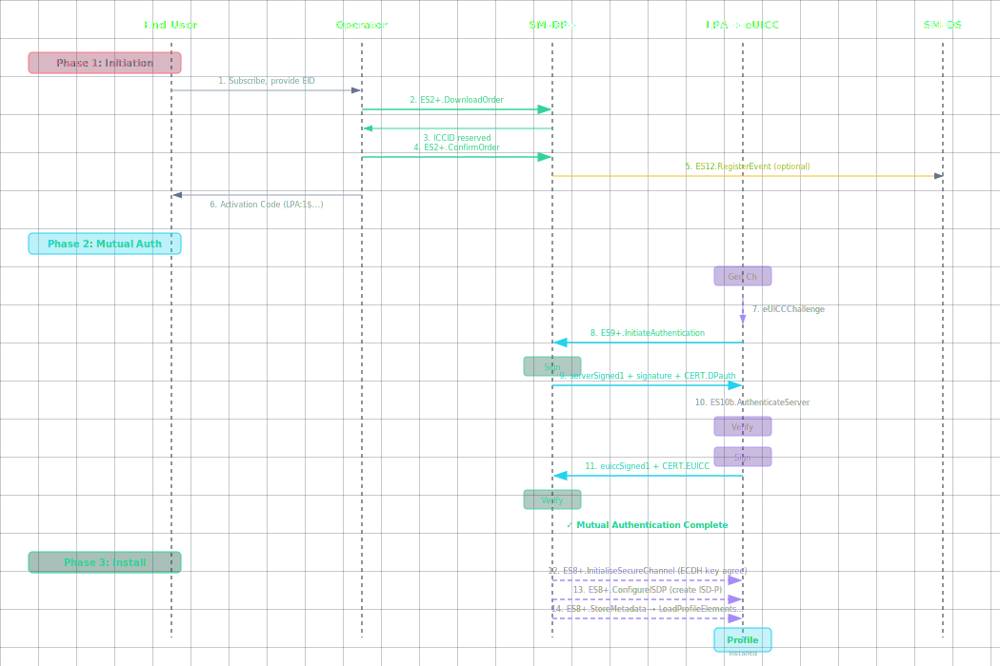

# How a Profile Gets Delivered: The eSIM Download Process

**🏠 [eUICC.tech]({{ site.baseurl }}/) > [SGP.22 Consumer RSP]({{ site.baseurl }}/docs/articles/sgp22/) > How a Profile Gets Delivered: The eSIM Download Process**

> **💡 Why this matters:** The profile download is the core transaction in the eSIM ecosystem: it's where all the cryptographic infrastructure proves itself. Every component (SM-DP+, SM-DS, LPA, eUICC, GSMA CI) participates. Understanding the full three-phase flow at protocol level is essential for debugging interoperability issues, implementing an RSP component, or integrating with any eSIM platform.

> **Key takeaways:**
> - Profile delivery spans three tightly-sequenced phases: **ordering** via `ES2+`, **mutual authentication** via `ES9+`/`ES10b`, and **encrypted installation** via `ES8+`
> - The server must authenticate **first** : the eUICC is forbidden from revealing any private data or generating signed material before verifying the SM-DP+
> - Four transformation stages turn raw operator data into a chip-locked encrypted package: **UPP** → **PPP** → **BPP** → **SBPP**
> - All `ES8+` communication uses SCP03t with Perfect Forward Secrecy keys from ephemeral ECDH: the LPA cannot read a single byte
> - 14 specific error codes catch every failure mode from ICCID collision to policy rule violations, with automatic rollback on failure

---
* TOC
{:toc}

Downloading an eSIM profile is a multi-party cryptographic protocol involving the end user, the operator's backend, the SM-DP+ profile factory, the SM-DS discovery server, the LPA on-device software, and the eUICC chip itself. The process is defined in SGP.22 Section 3 and spans three distinct phases, each with its own interfaces, security guarantees, and error-recovery mechanisms.



---

## Phase 1: Initiation: Making the Order

Before a single byte of profile data moves, the operator must prepare a Profile for a specific eUICC and make it available for download. This phase uses the `ES2+` interface between the Operator and SM-DP+, plus optionally `ES12` for SM-DS event registration.

### The Activation Code

The end user receives an **Activation Code** : a deceptively simple string that kicks off the entire process. The standard format is:

```
LPA:1$smdp.example.com$MATCHING-ID-12345
```

Breaking this down:
- `LPA:1` : Protocol identifier and version. Tells the LPA this is an RSP activation code
- `smdp.example.com` : The SM-DP+ address (FQDN or IP). The LPA connects here
- `MATCHING-ID-12345` : An opaque identifier generated by the SM-DP+ that links the activation to a specific pending profile

**Optional fields** can appear after the Matching ID:
- `$CONFIRMATION-CODE` : Used when the operator requires additional user verification
- `$SM-DS-ADDRESS` : Explicit SM-DS address for discovery

The Activation Code may also appear as a **QR code** encoding this same string. The LPA scans it, parses it, and initiates the download workflow. No user-identifying information is contained in the code: the security binding is entirely cryptographic.

### ES2+ Ordering Flow

The operator communicates with the SM-DP+ through the `ES2+` interface (a SOAP/HTTPS web service). Three ordering modes exist:

#### Default Mode: DownloadOrder → ConfirmOrder

```
Operator → SM-DP+: ES2+.DownloadOrder
    Parameters:
        - EID (optional: if provided, enables EID-based profile binding)
        - ProfileType (identifies the profile product/template)
        - ICCID (optional: operator-specified ICCID, or SM-DP+ allocates)
        - Notification recipients (callback URLs for status updates)

SM-DP+:
    - Validates that ProfileType exists and is active
    - If EID provided: checks eUICC compatibility
    - Allocates an ICCID (if not operator-specified)
    - Reserves profile capacity
    - Optionally registers an Event on the SM-DS (via ES12)

SM-DP+ → Operator: ICCID + EventID (if SM-DS used)

Operator → SM-DP+: ES2+.ConfirmOrder
    Parameters:
        - ICCID (confirms which order)
        - EID (mandatory if not provided in DownloadOrder)
        - MatchingID (generated by SM-DP+ or operator-specified)
        - Confirmation Code (optional: user-facing verification)
        - SM-DS Address (if push delivery desired)
        - ReleaseFlag (see below)
```

**ReleaseFlag** controls when the profile becomes available for download:
- `true` : Profile is released immediately after confirmation. The device can download it right away.
- `false` : Profile is held in "pending" state. Requires a separate `ES2+.ReleaseProfile` call to activate. Useful for staged rollouts.

#### Activation Code Mode: ConfirmOrder Only

When the operator already has the eUICC information (e.g., from a previous EID capture during signup), they can skip `DownloadOrder`:

```
Operator → SM-DP+: ES2+.ConfirmOrder
    Parameters:
        - ICCID (previously allocated)
        - MatchingID (must match what will appear in the Activation Code)
        - EID
        - Confirmation Code (optional)
```

This is the fastest path: commonly used for prepaid activations and QR-code purchases.

#### SM-DS Push Mode

When the SM-DS is involved (for push notification rather than manual QR code scanning):

```
SM-DP+ → SM-DS: ES12.RegisterEvent
    Parameters:
        - EID (which eUICC should be notified)
        - EventID (generated by SM-DP+)
        - SM-DP+ Address (where the device should connect)
        - Event validity period

SM-DS: Stores the event record
```

The device polls the SM-DS periodically via `ES11`. When it finds a pending event, the LPA extracts the SM-DP+ address and Matching ID and initiates download automatically: no QR code needed.

### Cancel and Release Operations

**ES2+.CancelOrder** : Cancels a pending order before the profile is downloaded:
```
Operator → SM-DP+: ES2+.CancelOrder(ICCID)
SM-DP+:
    - If profile not yet downloaded: releases ICCID, cancels SM-DS event
    - If profile already downloaded: returns error
```

**ES2+.ReleaseProfile** : Makes a held profile available for download:
```
Operator → SM-DP+: ES2+.ReleaseProfile(ICCID)
SM-DP+ → SM-DS: ES12.RegisterEvent (if SM-DS configured)
SM-DP+ → Operator: Confirmation
```

**ES2+.HandleNotification** : The SM-DP+ pushes status updates to operator callbacks:
- `DownloadProgress` : incremental progress during installation
- `DownloadCompleted` : installation finished successfully
- `DownloadFailed` : installation error with error code
- `ProfileEnabled` : profile was activated by the user
- `ProfileDeleted` : profile was removed from the eUICC

---

## Phase 2: Mutual Authentication: Cryptographic Identity Verification

Before any profile data flows, both endpoints must cryptographically prove their identities. This is the **Common Mutual Authentication** procedure: used identically for SM-DP+ and SM-DS communication: and it's where the entire PKI infrastructure comes to life.

### Protocol Overview

The mutual authentication exchange proceeds through 16 steps across three interfaces: `ES10a` (LPA → eUICC info), `ES10b` (LPA → eUICC auth), and `ES9+` (LPA → SM-DP+).

```
┌─────────────────────────────────────────────────────────┐
│                  Mutual Authentication Flow              │
│                                                         │
│  eUICC ◄──── ES10b ────► LPA ◄──── ES9+ ────► SM-DP+  │
│   │                       │                    │        │
│   │ 1. Generate challenge │                    │        │
│   │ 2. Verify DP cert     │                    │        │
│   │ 3. Verify DP signature│                    │        │
│   │ 4. Sign client proof  │                    │        │
│   │                       │                    │        │
│   └───────────────────────┴────────────────────┘        │
│         Server authenticates FIRST                      │
│         eUICC never reveals data before verification     │
└─────────────────────────────────────────────────────────┘
```

### Step-by-Step Detail

**Steps 1–2: Gathering eUICC Information (Optional)**

```
LPA → eUICC: ES10a.GetEUICCInfo
    Parameters: None

eUICC → LPA: euiccInfo1
    - SVN (Specification Version Number: which SGP.22 version)
    - eUICC firmware version
    - Available memory (free non-volatile storage)
    - Supported Java Card / GlobalPlatform version
    - Supported profile protection types (single-layer, dual-layer)
    - URIC (Universal RSP Identifier Code)
```

The SM-DP+ uses `euiccInfo1` to verify compatibility before sending a profile. If the eUICC doesn't support the profile's required features, the SM-DP+ can abort early without wasting bandwidth.

**Steps 3–4: Challenge Generation**

```
LPA → eUICC: ES10b.GetEUICCChallenge

eUICC:
    1. Generate a cryptographically random euiccChallenge (32 bytes)
    2. Store it internally for later verification
    3. The challenge is fresh for every session: no reuse

eUICC → LPA: euiccChallenge, euiccInfo1
```

The `euiccChallenge` is a nonce that prevents replay attacks. Without it, an attacker could capture a valid authentication and replay it to impersonate the eUICC.

**Step 5: TLS Establishment**

```
LPA ↔ SM-DP+: Establish HTTPS connection

LPA:
    1. Initiates standard TLS 1.2+ handshake with SM-DP+
    2. Server presents CERT.DP.TLS (X.509)
    3. LPA verifies CERT.DP.TLS:
        a. Certificate chain leads back to GSMA CI root
        b. Certificate is within validity period
        c. Certificate has not been revoked (CRL check)
        d. Subject Alternative Name matches the SM-DP+ address
    4. If TLS verification fails → abort with user-visible error
    
SM-DP+: Standard server-side TLS
```

The TLS layer provides transport security between the LPA and SM-DP+. But critically, the RSP spec does **not** trust TLS alone: the mutual authentication adds an additional application-layer cryptographic binding on top.

**Steps 6–7: Authentication Initiation**

```
LPA → SM-DP+: ES9+.InitiateAuthentication
    Parameters:
        - euiccChallenge (raw bytes from eUICC)
        - euiccInfo1 (as received from eUICC)
        - SM-DP+ Address (the address the LPA connected to)

SM-DP+:
    1. Verifies SM-DP+ Address matches its own known address
       (prevents MITM relay attacks)
    2. Checks euiccInfo1 for compatibility:
        - SVN version compatibility
        - Available memory sufficient for profile
        - Profile type supported by eUICC
    3. If incompatible → return error, do not proceed
    4. Generates a fresh TransactionID (UUID: binds entire session)
    5. Generates a fresh serverChallenge (random 32 bytes)
    6. Retrieves the appropriate CI public key identifier
       (euiccCiPKIdToBeUsed: tells the eUICC which CI key to use)
```

**Steps 8–9: Server Signs the Challenge**

This is the critical authentication step where the SM-DP+ proves its identity:

```
SM-DP+ builds serverSigned1:
    serverSigned1 = {
        TransactionID,          // Fresh UUID for this session
        euiccChallenge,         // Echo: proves server saw the challenge
        serverChallenge,        // Server's own fresh nonce
        SM-DP+ Address          // Prevents redirect to a different SM-DP+
    }

SM-DP+ computes serverSignature1:
    serverSignature1 = ECDSA_Sign(
        SK.DPauth.ECDSA,       // SM-DP+'s private authentication key
        SHA256(serverSigned1)  // Hash before signing
    )

SM-DP+ → LPA:
    - TransactionID
    - serverSigned1 (raw structure)
    - serverSignature1 (ECDSA signature, DER-encoded)
    - euiccCiPKIdToBeUsed (which CI key the eUICC should verify against)
    - CERT.DPauth.ECDSA (SM-DP+ authentication certificate)
```

**Steps 10–14: eUICC Verifies the Server**

This is where the eUICC's secure element flexes its cryptographic muscles:

```
LPA → eUICC: ES10b.AuthenticateServer
    Parameters:
        - serverSigned1
        - serverSignature1
        - euiccCiPKIdToBeUsed
        - CERT.DPauth.ECDSA
        - ctxParams1 (context: includes MatchingID, Confirmation Code if applicable)

eUICC performs verification, IN ORDER:

1. Certificate Chain Verification:
    a. Look up PK.CI.ECDSA in ECASD using euiccCiPKIdToBeUsed
    b. Verify CERT.DPauth.ECDSA signature using PK.CI.ECDSA
    c. Verify certificate validity period
    d. Check CRL for revocation status
    e. If any check fails → abort with authentication error

2. Signature Verification:
    a. Extract PK.DPauth.ECDSA from CERT.DPauth.ECDSA
    b. Verify serverSignature1 over SHA256(serverSigned1)
    c. If signature invalid → abort (possible MITM attack)

3. Challenge Verification:
    a. Extract euiccChallenge from serverSigned1
    b. Verify it matches the challenge sent in Step 4
    c. If mismatch → abort (replay attack detected)

4. Address Verification:
    a. Extract SM-DP+ Address from serverSigned1
    b. Verify it matches expected address
    c. If mismatch → abort (redirect attack detected)

IF ALL CHECKS PASS:

eUICC now trusts the SM-DP+. It proceeds to:
    a. Generate euiccSigned1 = {
        TransactionID,      // Must match server's TransactionID
        serverChallenge,    // Echo: proves eUICC saw server challenge
        euiccInfo2,         // eUICC info (different from euiccInfo1)
        ctxParams1          // Echo context params (binds to LPA session)
    }
    b. Compute euiccSignature1 = ECDSA_Sign(
        SK.EUICC.ECDSA,        // eUICC's private key (never leaves ECASD)
        SHA256(euiccSigned1)
    )

eUICC → LPA:
    - euiccSigned1
    - euiccSignature1
    - CERT.EUICC.ECDSA (eUICC's unique certificate)
    - CERT.EUM.ECDSA (EUM certificate for chain verification)
```

**euiccInfo2 vs euiccInfo1:**
- `euiccInfo1` is informational (version, memory, capabilities) : sent before server auth
- `euiccInfo2` is the signed attestation: includes the same data but cryptographically bound to the session, proving it came from a genuine eUICC

**ctxParams1** carries context from the LPA. It typically includes:
- `matchingId` : extracted from the Activation Code
- `confirmationCode` : if the user entered one
- Additional LPA-specific parameters

The eUICC signing `ctxParams1` into `euiccSigned1` binds the LPA's session context to the cryptographic handshake, preventing an attacker from substituting a different Matching ID.

**Steps 15–16: SM-DP+ Verifies the eUICC**

```
LPA → SM-DP+: ES9+.AuthenticateClient
    Parameters:
        - TransactionID
        - euiccSigned1
        - euiccSignature1
        - CERT.EUICC.ECDSA
        - CERT.EUM.ECDSA

SM-DP+ performs verification, IN ORDER:

1. EUM Certificate Verification:
    a. Verify CERT.EUM.ECDSA signature using PK.CI.ECDSA
    b. Verify EUM is listed in GSMA SAS-UP certified manufacturers
    c. Check CRL for EUM certificate revocation

2. eUICC Certificate Verification:
    a. Extract PK.EUM.ECDSA from CERT.EUM.ECDSA
    b. Verify CERT.EUICC.ECDSA signature using PK.EUM.ECDSA
    c. Verify eUICC certificate validity period

3. Signature Verification:
    a. Extract PK.EUICC.ECDSA from CERT.EUICC.ECDSA
    b. Verify euiccSignature1 over SHA256(euiccSigned1)

4. Content Verification:
    a. Verify TransactionID matches
    b. Verify serverChallenge matches (was echoed correctly)
    c. Extract MatchingID from euiccSigned1.ctxParams1
    d. Match the profile to this specific eUICC + MatchingID

IF ALL CHECKS PASS:
    The SM-DP+ now has:
        - Verified it's talking to a genuine GSMA-certified eUICC
        - Confirmed the eUICC's unique identity (EID from CERT.EUICC)
        - Bound the transaction to the correct MatchingID
        - Established cryptographic proof that neither side is being impersonated
```

### Key Security Properties

| Property | How It's Enforced |
|----------|-------------------|
| **Server authenticates first** | eUICC SHALL NOT reveal private data or generate signed material before verifying server (SGP.22 §3.1.2) |
| **LPA is untrusted** | All crypto happens on eUICC. LPA only transports opaque blobs. No LPA key material exists. |
| **Replay prevention** | Fresh `euiccChallenge` + `serverChallenge` per session. `TransactionID` binds all steps. |
| **MITM prevention** | `SM-DP+ Address` in `serverSigned1` : the eUICC checks it matches |
| **Forward secrecy** | Separate key agreement after auth (see Phase 3). Compromised long-term keys don't expose past sessions. |
| **Revocation** | CRL checking at both ends before trusting any certificate |

---

## Phase 3: Profile Download and Installation

With mutual authentication complete, the actual profile download begins. This phase uses the `ES8+` interface: an **end-to-end encrypted channel** between SM-DP+ and eUICC that tunnels through the LPA. The LPA sees encrypted ciphertext only.

### The ES8+ Protocol

`ES8+` is not a transport protocol: it's a message format carried by the LPA:

```
SM-DP+ → LPA (HTTPS/ES9+): ES8+ command block
LPA → eUICC (APDU/ES10b): ES8+ command block (opaque: LPA cannot decrypt)
eUICC → LPA: ES8+ response block
LPA → SM-DP+: ES8+ response block (opaque: LPA cannot decrypt)
```

Every `ES8+` command is encrypted with **SCP03t** (GlobalPlatform Secure Channel Protocol 03, transport-optimised) using session keys derived from an ephemeral ECDH key exchange. This provides:
- **Confidentiality** : AES-128-CBC encryption
- **Integrity** : AES-CMAC-128 message authentication
- **Perfect Forward Secrecy** : ephemeral keys discarded after transaction
- **Replay protection** : MAC chaining with incrementing counters

### Step 1: Secure Channel Establishment

```
SM-DP+ → eUICC (via LPA): ES8+.InitialiseSecureChannel

SM-DP+ generates:
    1. Ephemeral ECDH key pair (otPK.DP.ECKA, otSK.DP.ECKA)
       - ECKA = Elliptic Curve Key Agreement (P-256)
       - These keys exist only for this one transaction
    2. Key agreement data = {otPK.DP.ECKA, key usage qualifier}

SM-DP+ sends the key agreement data to the eUICC.
The data is sent in the clear (integrity from mutual auth signatures).

eUICC:
    1. Generates its own ephemeral ECDH key pair
    2. Computes shared secret = ECDH(otSK.EUICC.ECKA, otPK.DP.ECKA)
    3. Derives session keys from shared secret using KDF:
        - S-ENC  = AES-128-CBC encryption key
        - S-MAC  = AES-128-CMAC integrity key
        - Initial MAC chaining value
    4. Returns its ephemeral public key to SM-DP+

SM-DP+:
    1. Computes shared secret = ECDH(otSK.DP.ECKA, otPK.EUICC.ECKA)
    2. Derives same session keys (identical derivation function)

BOTH SIDES NOW HAVE: S-ENC, S-MAC, initial MAC chaining value
```

**Why ephemeral ECDH?** The SM-DP+ generates a fresh key pair for every transaction. Even if an attacker later compromises the SM-DP+'s long-term authentication key (`SK.DPauth.ECDSA`), they cannot decrypt past profile downloads because the session keys are derived from ephemeral keys that were discarded immediately after use. This is **Perfect Forward Secrecy**.

The session keys are used for **all subsequent `ES8+` commands** (until `ReplaceSessionKeys` swaps them out).

### Step 2: ISD-P Creation

```
SM-DP+ → eUICC (via LPA): ES8+.ConfigureISDP
    Payload (encrypted with S-ENC, MACed with S-MAC):
        - ISD-P AID (Application ID: unique identifier for this profile slot)
        - ISD-P configuration parameters
        - Initial security domain keys
        - Privileges and life-cycle state

eUICC:
    1. Decrypts and verifies MAC
    2. Creates new ISD-P in the eUICC file system
    3. Allocates storage quota
    4. Initialises ISD-P to CREATED state
    5. If any step fails → rollback, return specific error code
    
eUICC → SM-DP+: ISD-P creation status (success or error code)
```

The ISD-P is the container that will hold the operator's profile. It's a GlobalPlatform Issuer Security Domain with a dedicated key set, completely isolated from other ISD-Ps on the same chip.

### Step 3: Store Metadata

```
SM-DP+ → eUICC (via LPA): ES8+.StoreMetadata
    Payload (MAC protected: metadata is non-sensitive):
        - ICCID (Integrated Circuit Card ID: globally unique SIM identifier)
        - Profile Name (operator-displayable, e.g., "Vodafone UK")
        - Operator Name (MNO name)
        - Profile Class:
            - Operational (standard user profile)
            - Provisioning (used during manufacturing/testing)
            - Test (non-operational)
        - Profile Policy Rules (PPR):
            - ppr1: Disabling allowed? (YES/NO)
            - ppr2: Deletion allowed? (YES/NO)
            - ppr3: Profile deletion notification required?
            - Additional operator-defined rules
        - Icon (optional: displayed in LUI profile switcher)
        - Contact information (operator support details)

eUICC:
    1. Verifies MAC
    2. Stores metadata in ISD-P's file system
    3. If ICCID already exists on eUICC → error code 9
    4. If PPR conflicts with Profile Policy Enabler → error code 15
```

**Why MAC-only for metadata?** Metadata is not secret: the ICCID and operator name are publicly meaningful. Encryption would add unnecessary overhead. The MAC ensures the metadata hasn't been tampered with in transit.

### Step 4: Replace Session Keys (Optional: Dual-Layer Protection)

This step is only used when the profile was **pre-encrypted** at the SM-DP+ (dual-layer protection):

```
SM-DP+ → eUICC (via LPA): ES8+.ReplaceSessionKeys
    Payload (encrypted with current S-ENC, MACed with S-MAC):
        - PPK-ENC (Profile Protection Key: encryption)
        - PPK-MAC (Profile Protection Key: MAC)
        - New MAC chaining value
        - Profile protection key identifier

eUICC:
    1. Decrypts new keys using current S-ENC
    2. Verifies MAC using current S-MAC
    3. Atomically swaps: S-ENC → PPK-ENC, S-MAC → PPK-MAC
    4. Subsequent ES8+ commands use the new keys
```

**Single-layer vs Dual-layer protection:**

| Aspect | Single-Layer | Dual-Layer |
|--------|-------------|------------|
| Profile encryption | Real-time, during download | Pre-encrypted at SM-DP+ |
| When profile is ready | When eUICC connects | Hours/days before connection |
| Session keys used | S-ENC/S-MAC (from ECDH) | PPK-ENC/PPK-MAC (profile-specific) |
| Scale | Good for on-demand | Better for bulk pre-generation |
| Session key rotation | N/A | Via ReplaceSessionKeys |

Dual-layer protection enables **profile pre-generation** : critical when thousands of profiles need to be ready before the devices even power on.

### Step 5: Load Profile Elements

This is the bulk data transfer. The profile payload is streamed in multiple `ES8+.LoadProfileElements` calls:

```
SM-DP+ → eUICC (via LPA): ES8+.LoadProfileElements (repeated until complete)
    Each payload (encrypted SCP03t envelope):
        - One or more Profile Elements (TLV-encoded)
        - MAC chaining value (increments with each segment)
        - Sequence number (for reassembly and gap detection)

Profile Element types:
    - PE-TAR (Tar File) : SIM file system binary
    - PE-NAA (Network Access Application) : authentication applet
    - PE-CD (Content Description) : metadata descriptor
    - PE-SD (Supplementary Security Domain) : additional isolation
    - PE-AC (Access Control) : file access permissions
    - PE-KEYS (Cryptographic Keys) : OTA keys, authentication vectors
    - PE-END (End Marker) : signals installation complete

For each element:
    eUICC Profile Package Interpreter:
        1. Decrypts element (S-ENC or PPK-ENC)
        2. Verifies MAC
        3. Validates TLV structure
        4. Checks element against profile policy rules
        5. Writes to ISD-P file system
        6. If any element fails:
            - Rollback entire installation (removes ISD-P)
            - Return specific error code to SM-DP+

    eUICC → SM-DP+: 
        - Elements processed count
        - Success or error code per segment
```

The **Profile Package Interpreter** is the eUICC's internal component that understands Profile Element TLV format. It's essentially a specialised bytecode interpreter: each element is a command that creates files, installs applets, or writes keys.

**SCP03t transport encoding:**
- Command APDU format: `[CLA][INS][P1][P2][Lc][Data][Le]`
- Response APDU format: `[Data][SW1][SW2]`
- Each APDU ≤ 255 bytes (standard ISO 7816-4 limit)
- Extended APDU support for larger payloads (up to 65535 bytes)
- MAC chaining: each command's MAC is chained to the previous, creating a cryptographic ordering guarantee

### Step 6: Finalisation

After the last `LoadProfileElements` call (containing PE-END):

```
SM-DP+ → eUICC (via LPA): ES8+.FinaliseISDP

eUICC:
    1. Verifies all elements were received
    2. Runs integrity check on ISD-P file system
    3. Transitions ISD-P from CREATED → DISABLED state
    4. Seals the ISD-P (no further modifications without new session)
    5. Discards session keys (S-ENC, S-MAC, PPK keys)
    6. Logs installation completion

SM-DP+ → Operator: ES2+.HandleNotification(DownloadCompleted, ICCID, ...)
```

The Profile is now installed on the eUICC in the **Disabled** state. It will not become active until the user (or LPA) explicitly enables it via `ES10c.EnableProfile`. If this is the only profile on the eUICC (or the first one), the LPA may enable it immediately after installation.

---

## Profile Package Stages

The profile data transforms through four stages on its journey from operator data to encrypted eUICC installation:

| Stage | Name | What Happens | Where | Protection |
|-------|------|-------------|-------|-----------|
| **1. UPP** | Unprotected Profile Package | Operator profile data assembled into Trusted Connectivity Alliance (TCA, formerly SIMalliance) TLV structure | Inside SM-DP+ | None (internal only) |
| **2. PPP** | Protected Profile Package | UPP encrypted with SCP03t. Profile Protection Keys generated. | Inside SM-DP+ | Encrypted (PPK-ENC/MAC) |
| **3. BPP** | Bound Profile Package | PPP + ECDH key agreement + ISD-P config + metadata. Cryptographically locked to one specific eUICC. | SM-DP+ output | Bound to eUICC via ECDH + ECDSA |
| **4. SBPP** | Segmented Bound Profile Package | BPP split into STORE DATA APDU sequence for ISO 7816 transport | In transit LPA → eUICC | SCP03t encrypted per-APDU, MAC-chained |

**Why four stages?** The progression reflects increasing specificity:
1. UPP is generic: any operator could produce this
2. PPP encrypts it: now only someone with the PPK can read it
3. BPP locks it to a chip: even with the PPK, it won't install on a different eUICC
4. SBPP chunks it for transport: accommodating the 255-byte APDU limit

The cryptographic binding at stage 3 (BPP) is what makes eSIM profiles non-transferable. Copying the BPP to another device is useless: the ECDH key agreement ensures it only decrypts on the eUICC that possesses the matching private key.

---

## Complete Error Code Reference

SGP.22 defines 14 specific error codes for profile installation failures. Each is returned through the `ES8+` channel to the SM-DP+, which may relay them to the operator via `ES2+` notifications.

| Code | Name | What Went Wrong | Recovery |
|------|------|----------------|----------|
| 1 | `installFailedDueToGenericError` | Unspecified failure | Retry or escalate |
| 2 | `installFailedDueToAuthenticationFailure` | Mutual auth verification failed | Check certificates, retry |
| 3 | `installFailedDueToUserRejection` | User dismissed the download | Wait for user retry |
| 4 | `installFailedDueToTimeout` | Session expired | Restart from Phase 2 |
| 5 | `installFailedDueToPprNotAllowedByPolicy` | PPRs conflict with Profile Policy Enabler | Review policy configuration |
| 6 | `installFailedDueToInvalidatedConfirmationCode` | Confirmation code wrong after 3 attempts | Regenerate code |
| 7 | `installFailedDueToInvalidatedConfirmationCodeMaxAttemptsReached` | Confirmation code retries exhausted | New activation needed |
| 8 | `installFailedDueToProfileInvalid` | Profile incompatible with eUICC | Check profile/eUICC versions |
| 9 | `installFailedDueToIccidAlreadyExistsOnEuicc` | ICCID collision | Delete existing profile, retry |
| 10 | `installFailedDueToInsufficientMemoryForProfile` | Not enough free storage | Free space or smaller profile |
| 11 | `installFailedDueToInterruption` | Download interrupted mid-stream | Resume or restart |
| 12 | `installFailedDueToPEProcessingError` | Profile Element TLV decode/install failed | Fix profile package |
| 13 | `installFailedDueToDataMismatch` | Integrity check failed | Retry: possible corruption |
| 14 | `installFailedDueToForbiddenByPolicy` | Profile Policy Enabler blocked operation | Review PPE configuration |
| 15 | `pprNotAllowed` | Specific PPR violation (e.g., deletion when ppr2=false) | Review PPRs |

**Rollback behaviour:** For errors during installation (codes 9–14), the eUICC automatically rolls back: the partially-installed ISD-P is removed, storage is reclaimed, and the eUICC returns to its pre-download state. The SM-DP+ reports the failure to the operator, who may retry or issue a new order.

---

## Special Scenarios and Edge Cases

### Resumable Downloads

If a download is interrupted (`installFailedDueToInterruption`), the SM-DP+ can attempt a **resumable download**. The eUICC retains partial state and the SM-DP+ can skip already-delivered elements. Resumption is signalled in the `InitialiseSecureChannel` parameters.

### Multiple Concurrent Downloads

SGP.22 permits only **one active profile download** per eUICC at a time. If a second download is attempted while one is in progress, the eUICC returns an error. The LPA must serialise download requests.

### Profile Replacement

`ES2+` supports a `ReplaceProfile` option during ordering. The new profile can automatically replace an existing one:
- Old profile is disabled
- New profile is downloaded and installed
- Old profile is optionally deleted after successful installation
- Used for seamless carrier migration

### Emergency Profiles

Some profiles are designated as **Emergency Profiles** : they bypass normal policy restrictions and must always be installable. Used for critical security updates or regulatory compliance.

### Test Profiles

Test profiles are marked with Profile Class = Test. They have relaxed security requirements and are used during development and certification. Production eUICCs may reject test profiles based on their Profile Policy Enabler configuration.

---

## 📋 Summary

- Profile delivery uses three phases across five interfaces: `ES2+` (ordering), `ES9+`/`ES10a`/`ES10b` (mutual authentication), and `ES8+` (encrypted installation)
- The Activation Code (`LPA:1$...`) is the user-visible entry point: it contains only the SM-DP+ address and a Matching ID, all security is cryptographic
- Mutual authentication uses ECDSA P-256 with server-authenticates-first ordering: the eUICC reveals nothing before verifying the SM-DP+
- Session keys are derived from ephemeral ECDH, providing Perfect Forward Secrecy: compromising the SM-DP+ long-term key exposes zero past downloads
- The profile package goes through four stages (UPP → PPP → BPP → SBPP), with stage 3 cryptographically locking it to one specific chip
- SCP03t encryption protects every `ES8+` command with AES-128-CBC + AES-CMAC-128 + MAC chaining
- 15 specific error codes cover every failure mode, with automatic rollback on installation failure
- The LPA is a completely passive transport: all cryptographic operations happen on the eUICC and SM-DP+ endpoints
- The Profile Package Interpreter inside the eUICC decodes Profile Element TLVs sequentially, rolling back the entire installation if any element fails

---

<div align="center">

← Previous: [Inside the eUICC: The Secure Element That Powers Your eSIM]({{ site.baseurl }}/docs/articles/sgp22/02-inside-the-euicc) · [🏠 Home]({{ site.baseurl }}/)

Next: [eSIM Security: The PKI and Certificate Model]({{ site.baseurl }}/docs/articles/sgp22/04-esim-security-pki) →

</div>

---

*Based on GSMA SGP.22 v2.7 (24 April 2026), Section 3: Procedures, Section 4.5: Keys and Certificates, and Section 5: ES8+ Protocol Specification*


---

← Previous: [Inside the eUICC: The Secure Element That Powers Your eSIM](02-inside-the-euicc) | [Section Index](index) | Next: [eSIM Security: The PKI and Certificate Model](04-esim-security-pki) →
