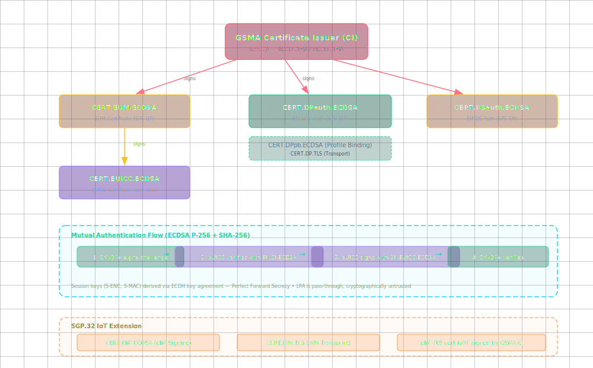

# eSIM Security: The PKI and Certificate Model

**🏠 [eUICC.tech]({{ site.baseurl }}/) > [SGP.22 Consumer RSP]({{ site.baseurl }}/docs/articles/sgp22/) > eSIM Security: The PKI and Certificate Model**

> **💡 Why this matters:** The eSIM security model is what makes it possible to deliver operator credentials over the public internet: through an untrusted device: without anyone in the middle being able to steal or tamper with them. Every eSIM download depends on this PKI.

> **Key takeaways:**
> - All trust chains back to a single root: the **GSMA Certificate Issuer (CI)**, whose public keys are burned into every eUICC at the factory
> - Seven certificate types serve distinct roles: chip identity, server authentication, transport encryption, and profile binding
> - Mutual authentication uses ECDSA on NIST P-256 with a critical ordering rule: server authenticates first
> - `ES8+` session keys provide **Perfect Forward Secrecy** : past downloads stay safe even if long-term keys are stolen
> - CRLs and CI key management allow the ecosystem to respond to certificate compromise

---

SGP.22's security architecture is built on a single principle: **no one in the middle can be trusted.** The LPA: the software on your phone that orchestrates profile downloads: is explicitly treated as untrusted. It simply transports encrypted messages between two endpoints that verify each other directly.

This article explains how the Public Key Infrastructure (PKI) makes this possible, what certificates exist in the ecosystem, and how the system handles compromise.

---

## The Trust Chain

Every entity in the RSP ecosystem ultimately trusts the **GSMA Certificate Issuer (CI)**. The CI is the root Certificate Authority: it signs the certificates of EUMs, SM-DP+ providers, and SM-DS providers. The full trust chain is shown below:



**Key constraint:** Every certificate in the system must have its trust chain leading back to the same GSMA CI certificate. No cross-signing between CIs, no alternative trust roots.

---

## Certificate Types

### CI Certificate (`CERT.CI.ECDSA`)

The root. Contains the GSMA CI's public key and identifies the CI by a unique OID (Object Identifier). The eUICC stores the CI's **public key** (not the certificate itself), along with metadata extracted from the certificate:

- Certificate serial number (for CRL checking)
- GSMA CI OID (to identify which CI)
- Subject Key Identifier (for chain verification)

The eUICC may store multiple CI public keys from the same or different CIs: supporting CI key rotation.

### EUM Certificate (`CERT.EUM.ECDSA`)

Issued by the GSMA CI to an accredited EUM. Used to verify that an eUICC's certificate was issued by a legitimate manufacturer in a GSMA SAS-UP certified facility. Contains the EUM's public key, signed by the CI.

### eUICC Certificate (`CERT.EUICC.ECDSA`)

Unique per chip. Generated during manufacturing, signed by the EUM. Contains the eUICC's public key (`PK.EUICC.ECDSA`). The corresponding private key (`SK.EUICC.ECDSA`) never leaves the ECASD and is used for ECDSA signatures during mutual authentication.

### SM-DP+ Authentication Certificate (`CERT.DPauth.ECDSA`)

Proves an SM-DP+'s identity. Signed by the GSMA CI. During mutual authentication (step 9), the SM-DP+ sends this certificate to the eUICC along with a signature over the challenge data. The eUICC verifies:

1. The certificate chain: `CERT.DPauth.ECDSA` → `CERT.CI.ECDSA` (using `PK.CI.ECDSA`)
2. The certificate validity period
3. The certificate hasn't been revoked (via CRL)
4. The signature over `serverSigned1` matches the public key in the certificate

### SM-DP+ TLS Certificate (`CERT.DP.TLS`)

Standard X.509 certificate for HTTPS. Used in the TLS handshake between the LPA and SM-DP+. The LPA verifies this before sending any RSP-specific data. Must have its trust chain back to the same CI.

### SM-DP+ Profile Binding Certificate (`CERT.DPpb.ECDSA`)

Used for encrypting the profile specifically for the target eUICC. The profile binding key (`PK.DPpb.ECDSA`) is included in the key agreement data during `InitialiseSecureChannel`.

### SM-DS Authentication Certificate (`CERT.DSauth.ECDSA`)

Analogous to `CERT.DPauth.ECDSA`, but for the Discovery Server. Used during `ES11` mutual authentication when the device polls the SM-DS for pending profiles.

---

## The Mutual Authentication Protocol in Detail

The mutual authentication between SM-DP+ and eUICC uses **ECDSA** (Elliptic Curve Digital Signature Algorithm) with the P-256 curve. Here's what's actually signed:

### Server Authentication (SM-DP+ → eUICC)

```
serverSigned1 = {
    TransactionID,          // Fresh UUID for this session
    euiccChallenge,         // Echo back the eUICC's random challenge
    serverChallenge,        // SM-DP+'s own fresh random challenge
    SM-DP+ Address          // Prevents MITM redirecting to another SM-DP+
}

serverSignature1 = ECDSA_Sign(SK.DPauth.ECDSA, serverSigned1)
```

The eUICC verifies this with `PK.DPauth.ECDSA` from `CERT.DPauth.ECDSA`.

### Client Authentication (eUICC → SM-DP+)

```
euiccSigned1 = {
    TransactionID,          // Must match the server's TransactionID
    serverChallenge,        // Echo back the server's challenge
    euiccInfo2,            // eUICC information (version, capabilities)
    ctxParams1             // Context parameters from the LPA
}

euiccSignature1 = ECDSA_Sign(SK.EUICC.ECDSA, euiccSigned1)
```

The SM-DP+ verifies this with `PK.EUICC.ECDSA` from `CERT.EUICC.ECDSA`, and verifies that `CERT.EUICC.ECDSA` was signed by a valid EUM certificate.

**Critical ordering:** The server must authenticate **first**. The eUICC specification explicitly states: "The eUICC, as a Client, SHALL not reveal any private data to an unauthenticated Server. The eUICC, as a Client, SHALL not generate any signed material before having authenticated the Server."

---

## Session Key Generation

After mutual authentication, the profile download requires session keys with **Perfect Forward Secrecy**:

1. The SM-DP+ generates an ephemeral ECDH key pair for this transaction
2. The key agreement data is sent in the `InitialiseSecureChannel` block
3. Both sides derive shared session keys:
   - **S-ENC** : AES-128-CBC for encryption
   - **S-MAC** : AES-128 for message authentication (CMAC)
   - **Initial MAC chaining value** : prevents replay

These session keys are discarded after the transaction. Even if the SM-DP+'s long-term private key is stolen years later, past profile downloads cannot be decrypted.

---

## Profile Protection Options

Profiles can be protected at two levels:

**Single-layer protection:** The profile is encrypted directly with the session keys (S-ENC, S-MAC) established during key agreement. Simpler, but the SM-DP+ must have the profile ready when the eUICC connects.

**Dual-layer protection:** The profile is pre-encrypted with profile-specific **Profile Protection Keys** (PPK-ENC, PPK-MAC) during preparation at the SM-DP+. During download, an `ES8+.ReplaceSessionKeys` block swaps the session keys to the profile keys. This allows profiles to be pre-generated and stored before the eUICC ever connects: critical for large-scale profile provisioning.

---

## Certificate Revocation

Compromised certificates are handled through **Certificate Revocation Lists (CRLs)**:

- Published by the GSMA CI at a well-known URL
- Signed by the CI (so they cannot be forged)
- Include specific extensions for RSP (reason codes, invalidity dates)
- Loaded onto the eUICC via `ES10b.LoadCRL`
- The eUICC checks CRLs before trusting any certificate

The EUM may also revoke CI certificates directly on the eUICC (e.g., by deleting the compromised CI public key from the ECASD) in addition to CRL-based revocation.

---

## Elliptic Curve Specification

SGP.22 mandates:

| Parameter | Value |
|-----------|-------|
| Curve | **NIST P-256** (secp256r1) |
| Signature algorithm | **ECDSA** with SHA-256 |
| Key exchange | **ECDH** with ephemeral keys |
| Symmetric encryption | **AES-128** in CBC mode |
| MAC | **AES-CMAC-128** |
| Security strength | **128 bits** (sufficient beyond 2031 per NIST SP 800-57) |

---

## Certification Requirements

The ecosystem's security depends on rigorous certification:

- **eUICC**: Must be certified against the GSMA eUICC Protection Profile for Consumer Devices
- **EUM**: GSMA SAS-UP certified (Secure Accreditation Scheme: UICC Production)
- **SM-DP+**: GSMA SAS-SM certified (for Subscription Management)
- **SM-DS**: GSMA SAS-SM certified
- **Device/LPA**: Must comply with security features defined in SGP.21 and SGP.22

These certifications are verified through **Digital Letters of Approval (DLOAs)** : digitally signed attestations stored at a DLOA Registrar and retrievable by any management system that needs to verify a component's certification level.

---

## 📋 Summary

- The GSMA CI is the single root of trust: all seven certificate types chain back to it, and its public keys live in every eUICC's ECASD
- Mutual authentication uses ECDSA challenge-response with a strict server-first ordering rule; the eUICC never signs anything before verifying the server
- `ES8+` session keys use ephemeral ECDH for Perfect Forward Secrecy: even a fully compromised SM-DP+ can't decrypt past downloads
- Dual-layer profile protection (PPK-ENC/PPK-MAC) enables pre-generation at scale without sacrificing security
- CRLs loaded via `ES10b.LoadCRL` allow the ecosystem to revoke compromised certificates, and EUMs can directly delete CI keys from the ECASD

---

<div align="center" markdown="1">

← Previous: [How a Profile Gets Delivered: The eSIM Download Process]({{ site.baseurl }}/docs/articles/sgp22/03-profile-download) · [🏠 Home]({{ site.baseurl }}/)

Next: [Managing Your eSIM: Local Profile Operations]({{ site.baseurl }}/docs/articles/sgp22/05-local-profile-management) →

</div>

---

*Based on GSMA SGP.22 v2.7 (24 April 2026), Sections 2.6, 4.5, and 4.6: Security Overview, Keys and Certificates, and CRL*


---

← Previous: [How a Profile Gets Delivered: The eSIM Download Process](03-profile-download) | [Section Index](index) | Next: [Managing Your eSIM: Local Profile Operations](05-local-profile-management) →
