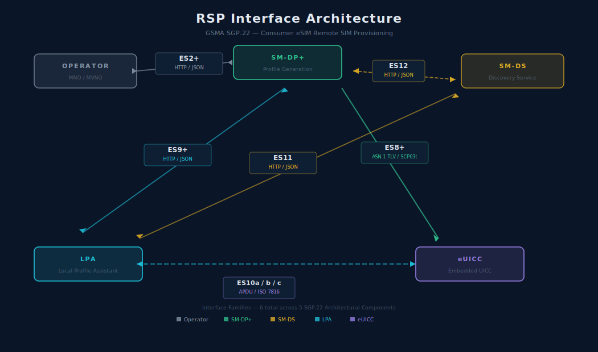

# The Developer's View: RSP Interfaces and Protocol Binding

**🏠 [eUICC.tech]({{ site.baseurl }}/) > [SGP.22 Consumer RSP]({{ site.baseurl }}/docs/articles/sgp22/) > The Developer's View: RSP Interfaces and Protocol Binding**

> **💡 Why this matters:** If you're building an LPA, an SM-DP+, or integrating eSIM into a device, this is your reference. Every function signature, HTTP endpoint, ASN.1 structure, and protocol binding rule is standardised: you just need to know where to look.

> **Key takeaways:**
> - Four interface families (`ES2+`, `ES8+`, `ES9+`, `ES10x`) cover ordering, secure delivery, LPA-server communication, and local chip access
> - `ES2+` and `ES9+` use HTTP/JSON with standardised headers; `ES8+` uses ASN.1 TLV encoding with SCP03t transport security
> - `ES10x` is the APDU-level interface over ISO 7816: there are 11 `ES10b` functions and 7 `ES10c` functions
> - Every function call carries a `functionCallIdentifier` for idempotency, retry safety, and audit trails
> - The SM-DS introduces an event-driven decoupling pattern: profiles can be generated today and discovered next week

---
* TOC
{:toc}

For developers implementing eSIM support: whether building an LPA, an SM-DP+, or integrating with an eUICC: understanding the function-level API and wire protocol is essential. SGP.22 defines every function call, every TLV structure, and both JSON and ASN.1 serialisation formats.



---

## The `ES2+` Interface: Operator to SM-DP+

The interface where profiles are ordered. All functions are HTTP/JSON.

### `DownloadOrder`

Reserves an ICCID and optionally a profile type for an eUICC.

```
POST /gsma/rsp2/es2plus/downloadOrder

Request:
{
  "header": { "functionRequesterIdentifier": "...", "functionCallIdentifier": "..." },
  "eid": "8901...",           // Optional: required if ICCID not specified
  "iccid": "8944...",         // Optional
  "profileType": "..."        // Optional: if ICCID is not present
}

Response:
{
  "header": { "functionExecutionStatus": { "status": "Executed-Success" } },
  "iccid": "8944..."          // The reserved ICCID
}
```

### `ConfirmOrder`

Finalises the order and triggers profile preparation.

```
POST /gsma/rsp2/es2plus/confirmOrder

Request:
{
  "header": { ... },
  "iccid": "8944...",         // Required
  "eid": "8901...",           // Optional: required if not in DownloadOrder
  "matchingId": "...",        // If empty, SM-DP+ generates it for Activation Code
  "confirmationCodeRequired": true,  // Optional: requires user to enter code
  "smdsAddress": "https://...",  // Required for SM-DS delivery
  "releaseFlag": true
}

Response:
{
  "header": { ... }
}
```

---

## The `ES8+` Interface: SM-DP+ to eUICC

The secure end-to-end channel tunnelled through the LPA. Uses SCP03t for transport security on top of the session keys.

### `InitialiseSecureChannel`

Establishes the ECDH key agreement and derives session keys (S-ENC, S-MAC).

```
BoundProfilePackage.initialiseSecureChannelRequest ::= [35] SEQUENCE {
    remoteOpId              INTEGER,        // ID reference
    transactionId           TransactionId,  // From mutual auth
    controlRefTemplate      OCTET STRING,   // Key agreement parameters
    smdpOtpk                OCTET STRING,   // SM-DP+ one-time public key (ECDH)
    smdpSign                OCTET STRING    // SM-DP+ signature
}
```

### `ConfigureISDP`

Creates the ISD-P with specified configuration. Encrypted and MACed with SCP03t.

### `StoreMetadata`

Writes Profile Metadata (ICCID, name, operator, policy rules). MAC-only (not encrypted).

### `ReplaceSessionKeys`

Swaps session keys for pre-computed profile protection keys. Optional.

### `LoadProfileElements`

Streams the profile payload in SCP03t segments. Called repeatedly until the complete profile is delivered.

---

## The `ES10x` Interface: LPA to eUICC

The local interface between the device and the chip. Implemented as APDU commands over the ISO 7816 interface (the same physical interface your SIM reader would monitor).

### `ES10a` Functions (Discovery)

| Function | Purpose |
|----------|---------|
| `GetEuiccConfiguredAddresses` | Returns configured SM-DP+ and SM-DS addresses |
| `SetDefaultDpAddress` | Sets the default SM-DP+ address on the eUICC |

### `ES10b` Functions (Profile Download)

| Function | Purpose |
|----------|---------|
| `PrepareDownload` | Initialises profile download session on eUICC |
| `LoadBoundProfilePackage` | Delivers BPP segments to eUICC for installation |
| `GetEUICCChallenge` | Requests fresh random challenge for mutual auth |
| `GetEUICCInfo` | Returns euiccInfo1 and euiccInfo2 |
| `ListNotification` | Returns list of pending SM-DS events |
| `RetrieveNotificationsList` | Gets notification metadata for a specific event |
| `RemoveNotificationFromList` | Deletes a processed notification |
| `LoadCRL` | Loads Certificate Revocation List onto eUICC |
| `AuthenticateServer` | Forwards server authentication data for eUICC verification |
| `CancelSession` | Cancels an in-progress profile download |
| `GetRAT` | Retrieves Rules Authorisation Table |

### `ES10c` Functions (Local Management)

| Function | Purpose |
|----------|---------|
| `GetProfilesInfo` | Returns all installed profiles with metadata |
| `EnableProfile` | Activates a specific profile |
| `DisableProfile` | Deactivates a profile |
| `DeleteProfile` | Permanently removes a profile |
| `eUICCMemoryReset` | Factory resets the eUICC |
| `GetEID` | Returns the eUICC's unique identifier |
| `SetNickname` | Assigns user-friendly name to a profile |

---

## The `ES9+` Interface: LPA to SM-DP+

HTTP/JSON interface for the LPA to communicate with the SM-DP+.

```json
// InitiateAuthentication
POST /gsma/rsp2/es9plus/initiateAuthentication
{
    "euiccChallenge": "base64...",
    "euiccInfo1": "base64...",
    "smdpAddress": "example.smdp.com"
}

// AuthenticateClient
POST /gsma/rsp2/es9plus/authenticateClient
{
    "transactionId": "...",
    "authenticateServerResponse": "base64...",
    "authenticateClientRequest": {
        "euiccSigned1": "base64...",
        "euiccSignature1": "base64...",
        "euiccCertificate": "base64...",
        "eumCertificate": "base64..."
    }
}

// GetBoundProfilePackage
POST /gsma/rsp2/es9plus/getBoundProfilePackage
{
    "transactionId": "...",
    "prepareDownloadResponse": "base64..."
}
```

---

## Protocol Binding Options

SGP.22 supports two serialisation formats:

### JSON Binding

All `ES2+`, `ES9+`, and `ES11` interfaces use JSON. Messages follow a request-response pattern with a standard header containing:

```
{
    "header": {
        "functionRequesterIdentifier": "operator-id",
        "functionCallIdentifier": "uuid",
        "functionExecutionStatus": {
            "status": "Executed-Success",
            "statusCodeData": { ... }
        }
    }
}
```

Status codes include success states (`Executed-Success`), error states (`Failed`), and expiration states.

### ASN.1 Binding

The `ES8+` interface (SM-DP+ → eUICC) and the Bound Profile Package structure use ASN.1 with TLV encoding. The ASN.1 definitions occupy Annex H of the specification: hundreds of lines of structured type definitions. The BPP structure itself is defined as:

```asn1
BoundProfilePackage ::= [54] SEQUENCE {
    initialiseSecureChannelRequest  [35] InitialiseSecureChannelRequest,
    firstSequenceOf87               [0]  SEQUENCE OF [7] OCTET STRING,
    sequenceOf88                    [1]  SEQUENCE OF [8] OCTET STRING,
    secondSequenceOf87              [2]  SEQUENCE OF [7] OCTET STRING OPTIONAL,
    sequenceOf86                    [3]  SEQUENCE OF [6] OCTET STRING
}
```

The tag numbers (`[54]`, `[35]`, `[0]`, etc.) correspond to the single-byte TLV tags used in the SCP03t transport layer (`BF36`, `BF23`, `A0`, `A1`, etc.).

---

## HTTP and TLS Requirements

All server-to-server and device-to-server communication uses HTTPS with TLS:

- **TLS 1.2** minimum, with specific cipher suites mandated
- **Server authentication mode** for `ES9+` and `ES11` (the server presents a certificate, the client does not)
- **Certificate validation** against the GSMA CI chain
- **HTTP response codes** standardised:
  - `200 OK` : function executed
  - `400 Bad Request` : malformed request
  - `401 Unauthorized` : authentication failure
  - `500 Internal Server Error` : unexpected server error

---

## Event-Driven Architecture

The SM-DS system introduces an event-driven pattern:

1. **SM-DP+ registers Event** via `ES12`: `RegisterEvent(EID, EventID, SM-DP+ address)`
2. **Device polls SM-DS** via `ES11`: `InitiateAuthentication → AuthenticateClient` (mutual auth), then retrieves pending events
3. **SM-DS cascading**: Events can propagate through multiple SM-DS instances via `ES15` for global coverage
4. **Event deletion**: After profile download, the SM-DP+ deletes the Event via `ES12`: `DeleteEvent(EID, EventID)`

This decouples profile availability from download timing: the SM-DP+ can generate a profile today, and the device can discover it next week.

---

## Function Call Identifiers

Every function call includes a `functionCallIdentifier` : a unique ID that enables:

- **Idempotency**: Repeating the same call with the same ID produces the same result
- **Retry logic**: Network failures can be retried without risk of double-execution
- **Audit trails**: Every operation in the system can be traced by its call ID

---

## 📋 Summary

- Four interface families cover the full eSIM lifecycle: `ES2+` (ordering, JSON), `ES8+` (secure delivery, ASN.1/SCP03t), `ES9+` (LPA-server, JSON), and `ES10x` (local chip access, APDU)
- The `ES8+` Bound Profile Package uses ASN.1 TLV encoding with SCP03t encryption: five function calls carry the entire profile payload through an untrusted LPA
- `ES10b` provides 11 functions for profile download orchestration; `ES10c` provides 7 for local management: all over ISO 7816 APDUs
- `functionCallIdentifier` headers provide idempotency, retry safety, and end-to-end auditability across every interface
- The SM-DS event pattern (`ES11`/`ES12`/`ES15`) decouples profile generation from delivery timing, enabling global-scale deferred provisioning

---

<div align="center" markdown="1">

← Previous: [Managing Your eSIM: Local Profile Operations]({{ site.baseurl }}/docs/articles/sgp22/05-local-profile-management) · [🏠 Home]({{ site.baseurl }}/)

</div>

---

*Based on GSMA SGP.22 v2.7 (24 April 2026), Sections 5 and 6: Functions and Interface Binding*


---

← Previous: [Managing Your eSIM: Local Profile Operations](05-local-profile-management) | [Section Index](index) | Next: [SGP.22 v2.7: LPAe: The In-eUICC Local Profile Assistant](07-lpae-in-euicc) →
