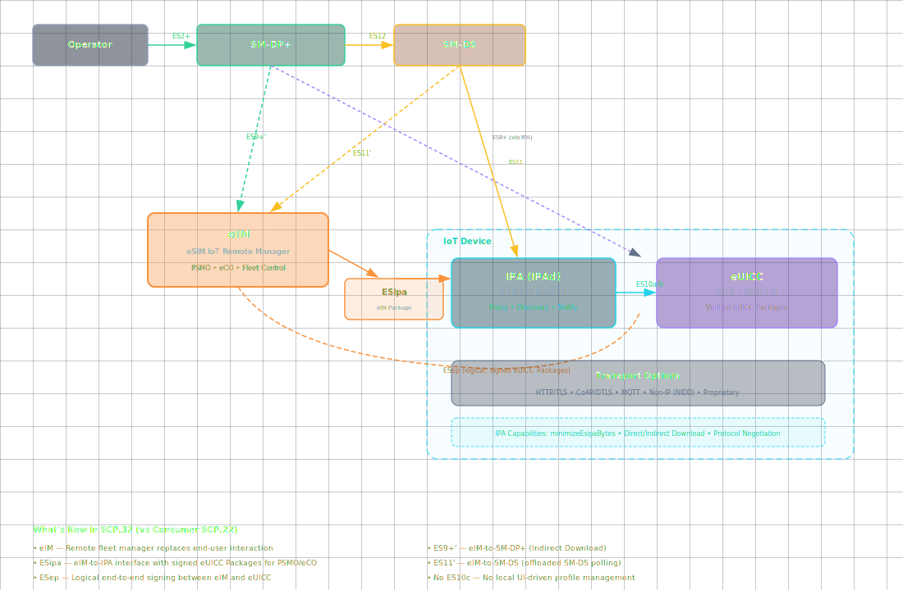

# The eSIM IoT Architecture: eIM, IPA, and the New Interfaces

**🏠 [eUICC.tech](/) > [SGP.32 IoT eSIM](/docs/articles/sgp32/) > The eSIM IoT Architecture: eIM, IPA, and the New Interfaces**

> **💡 Why this matters:** The IoT eSIM architecture adds two entirely new network players and four new interfaces on top of the consumer RSP model. Understanding how the `eIM` and `IPA` divide responsibilities — and what each interface carries — is the key to understanding the entire IoT provisioning system.

> **Key takeaways:**
> - Two new components: `eIM` (remote manager) and `IPA` (on-device proxy, in two variants: `IPAd` and `IPAe`)
> - Four new interfaces: `ESipa`, `ES9+'`, `ES11'`, and `ESep` (logical)
> - The `IPA` is a conduit, not a controller — all decisions are remote, pushed by the `eIM`
> - Consumer features (ES10c, Activation Code scanning, nicknames, LUI) are explicitly removed

The IoT eSIM architecture adds two new players and four new interfaces to the consumer RSP model. Understanding how the **`eIM`** and **`IPA`** work together — and what each interface carries — is the key to understanding the entire IoT provisioning system.

---

## The Extended Architecture

SGP.32 defines two deployment models, just like consumer RSP:

### IPA in the IoT Device (`IPAd`)

### IPA in the eUICC (`IPAe`)

Same topology, but the `IPA` lives inside the eUICC alongside ISD-R and ISD-Ps. The IoT Device becomes a thinner shell — the `IPAe` communicates with the `eIM` via the device's modem stack (CoAP/DTLS or HTTP/TLS), and the device itself doesn't need to understand eSIM protocols at all. This is ideal for ultra-constrained devices.

---

## The Players

### eIM — eSIM IoT Remote Manager

The remote brain. The `eIM`:

- Triggers profile downloads by pushing Activation Codes or SM-DS Events to the `IPA`
- Sends **eIM Configuration Operations (`eCO`)** to manage associated eIMs on the eUICC
- Sends **Profile State Management Operations (`PSMO`)** — enable, disable, delete
- Receives installation reports and notifications
- Can be part of a larger device management platform (LwM2M server, AWS IoT, Azure IoT Hub)
- Uses its own PKI certificates (`CERT.EIM.ECDSA` for signing, `CERT.EIM.TLS` for transport)

The `eIM` can configure itself as an "Associated eIM" on the eUICC — a cryptographically trusted relationship that persists across power cycles. Once associated, the `eIM` can send signed eUICC Packages that the eUICC verifies without needing to go through the full SM-DP+ mutual authentication flow.

---

### IPA — IoT Profile Assistant

The on-device proxy. The `IPA` provides four functions:

| Function | Role |
|----------|------|
| **Discovery Service** | Retrieves Event Records from SM-DS (when polling is used) |
| **Profile Download** | Two-stage proxy: (1) downloads Bound Profile Package from SM-DP+ in single transaction, (2) transfers it into the eUICC in SCP03t segments |
| **PSMO / eCO Conveying** | Forwards Profile State Management Operations and eIM Configuration Operations between `eIM` and eUICC |
| **Notification Handling** | Forwards installation results and errors to the `eIM` and SM-DP+ |

The `IPA` can also report its **IPA Capabilities** — telling the `eIM` what it can handle, including whether it supports compact data structures for minimising bytes over `ESipa`.

A key capability flag is `minimizeEsipaBytes` — when set, the `IPA` uses abbreviated ASN.1 tag structures to reduce airtime on constrained links.

---

## The Four New Interfaces

SGP.32 adds four interfaces that don't exist in consumer RSP:

### `ESipa` — eIM to IPA

The workhorse. Carries:
- **eIM Package Requests** (signed by the `eIM`): PSMOs (enable/disable/delete profiles) and eCOs (add/update/delete eIM configuration)
- **`IpaEuiccDataRequests`**: `eIM` asking the `IPA` to fetch data from the eUICC
- **Profile Download Triggers**: Activation Codes or SM-DS Event Records pushed from `eIM` to `IPA`
- **IPA Capabilities exchange**: What the `IPA` supports

Transport options: HTTPS over TCP, CoAPS over UDP/DTLS, or a proprietary protocol tunneled through the underlying transport layer (e.g., MQTT). This flexibility is critical — a CoAP-only LPWA device can't speak HTTPS.

---

### `ES9+'` — SM-DP+ to eIM

The `eIM`'s direct line to the SM-DP+. Used when the `eIM` handles profile download orchestration server-side rather than through the `IPA`. Similar to consumer `ES9+` but adapted for IoT flows.

---

### `ES11'` — SM-DS to eIM

The `eIM` retrieves Event Records from the SM-DS on behalf of the `IPA`. This is the "Option b" in profile download — the `eIM` polls the SM-DS, gets the event, then forwards it to the `IPA` via `ESipa`. This keeps polling traffic off the constrained IoT link entirely.

---

### `ESep` — eIM to eUICC (logical)

A logical end-to-end interface between the `eIM` and the eUICC, tunnelled through `ESipa`. Carries **eUICC Packages** — cryptographically signed payloads containing PSMOs and eCOs that the eUICC verifies directly using the `eIM`'s public key (stored in the eIM Configuration Data).

The `ESep` interface is what makes remote profile management possible without a user — the `eIM` sends a signed package saying "enable profile X," the eUICC verifies the signature against the `eIM`'s stored certificate, and executes the operation.

`ESep` is purely logical — there is no separate transport binding. eUICC Packages are carried inside `ESipa` and cryptographically verified end-to-end.

---

## What's Not in IoT

SGP.32 explicitly removes several consumer features:

- **No `ES10c` interface** — no local enable/disable/delete via LUI
- **No Activation Code retrieval** — no QR code scanning
- **No LUI or user-facing profile management**
- **No profile nicknames**

The `eIM` replaces all of these. Everything is remote.

---

## Communication Patterns

SGP.32 supports four protocol stacks for `ESipa`:

| Protocol | Transport | Security | Use Case |
|----------|-----------|----------|----------|
| HTTPS | TCP | TLS | IP-connected devices with full stack |
| CoAPS | UDP | DTLS | LPWA, NB-IoT, LoRaWAN gateways |
| MQTTs | TCP | TLS | MQTT-based device management platforms |
| Proprietary | Any | Underlying layer | Custom IoT stacks |

The protocol choice is configured per-eIM in the eIM Configuration Data via the `EimSupportedProtocol` bitfield — the eUICC knows which protocol each associated `eIM` speaks.

---

## 📋 Summary

- The IoT architecture adds `eIM` (remote manager) and `IPA` (on-device proxy) with four new interfaces
- `IPA` comes in two variants: `IPAd` (in device) for richer hardware, `IPAe` (in eUICC) for ultra-constrained devices
- All profile decisions are remote — the `IPA` is a conduit, and consumer LUI/ES10c features are removed
- Four protocol stacks (HTTPS, CoAPS, MQTTs, Proprietary) let the architecture scale from LPWA sensors to Linux gateways

---

← Previous: [eSIM for IoT: Why It Needed Its Own Architecture](/docs/articles/sgp32/07-iot-esim-why) · [🏠 Home](/)

Next: [IoT Profile Download: Direct, Indirect, and eIM Package Handling](/docs/articles/sgp32/09-iot-profile-download-packages) →

---

*Based on GSMA SGP.32 v1.3, Sections 2.1-2.3 and SGP.31 v1.3, Section 4*
