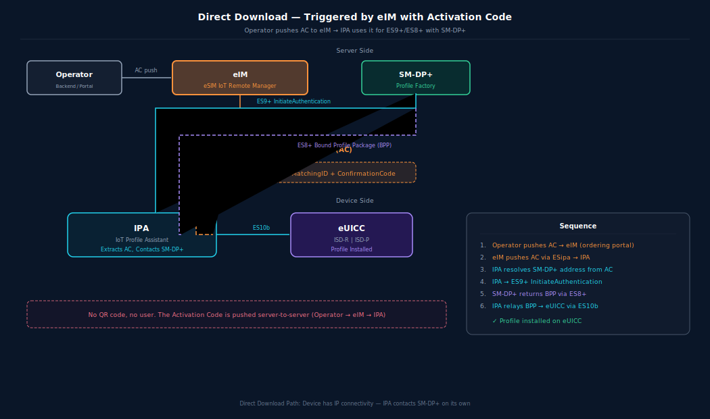
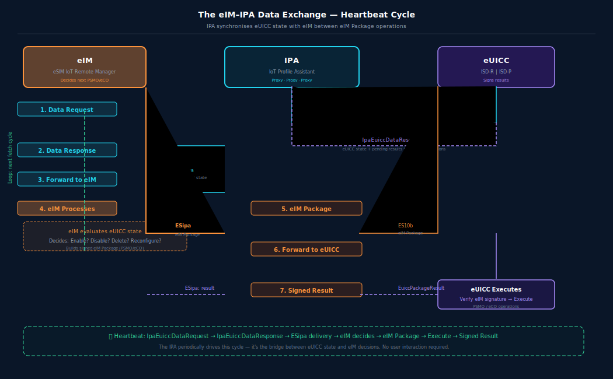

# IoT Profile Download: Direct, Indirect, and eIM Package Handling

**🏠 [eUICC.tech]({{ site.baseurl }}/) > [SGP.32 IoT eSIM]({{ site.baseurl }}/docs/articles/sgp32/) > IoT Profile Download: Direct, Indirect, and eIM Package Handling**

> **💡 Why this matters:** Profile delivery in IoT doesn't look anything like scanning a QR code on a phone. SGP.32 defines two parallel download paths: Direct (IPA-to-SM-DP+) and Indirect (eIM-mediated), plus a cryptographically signed eIM Package protocol that replaces every consumer interaction with a single binary blob. Choosing the right path for your device's connectivity model is central to any IoT eSIM deployment.

> **Key takeaways:**
> - Direct download: `IPA` talks to SM-DP+ directly, triggered by Activation Code or SM-DS Event
> - Indirect download: `eIM` handles all SM-DP+ interaction, `IPA` never connects to SM-DP+
> - eIM Packages are cryptographically signed payloads carrying PSMOs and eCOs: replacing all consumer user interactions
> - Two SM-DS polling options: Option A (IPA polls) for IP-connected devices, Option B (eIM polls) for constrained devices
> - Replay protection via per-eIM `counterValue` (max 8,388,607) and optional `associationToken`

Profile delivery in the IoT world has two paths: the `IPA` talks directly to the SM-DP+ (Direct), or the `eIM` mediates everything (Indirect). Both coexist in SGP.32, and the choice depends on the IoT device's connectivity model.

---

## Direct Profile Download

The `IPA` handles the download directly with the SM-DP+. Two triggers exist:

### Triggered by eIM with Activation Code



The Activation Code is pushed from the operator's backend to the `eIM`, no QR code, no user. The `IPA`'s job is to identify the SM-DP+ from the AC and relay the `ES8+` messages.

---

### Triggered by eIM with SM-DS Event

Two options exist for who retrieves the Event Record:

**Option A: IPA polls SM-DS:**


**Option B: eIM polls SM-DS:**


Option B is designed for **Network Constrained Devices**: devices on LPWA networks where the airtime cost of polling the SM-DS directly would be prohibitive. The `eIM` does the heavy lifting on the server side, where bandwidth is free.

---

## Indirect Profile Download

In Indirect mode, the `eIM` handles the entire SM-DP+ interaction. The `IPA` never opens a connection to the SM-DP+. This is used when:

- The IoT device can only reach the `eIM` (no internet access)
- The `eIM` acts as a security gateway, terminating TLS and re-encrypting
- The device uses a non-IP protocol that only the `eIM` understands


The `eIM` can also cancel an in-progress Indirect session using `CancelSession`, which propagates to both the SM-DP+ and the eUICC.

---

## The eIM Package Protocol

This is the most significant IoT innovation. An **eIM Package** is a cryptographically signed payload sent from the `eIM` to the eUICC through the `IPA`. It replaces the entire consumer "user opens LUI, taps Enable, confirms" flow with a single signed binary blob.

### eIM Package Request Structure

```
EuiccPackageRequest ::= [80] SEQUENCE {
    euiccPackageRequestData    CHOICE {
        psmoList              SEQUENCE OF Psmo,      -- Profile State Management
        ecoList               SEQUENCE OF Eco,       -- eIM Configuration
        euiccMemoryReset      ...,
        executeFallbackMechanism ...
    },
    eimSignEpReq              OCTET STRING,           -- eIM's ECDSA signature
    eimCertificate            Certificate OPTIONAL,   -- eIM's signing certificate
    eimTransactionId          TransactionId OPTIONAL  -- Correlates request to result
}
```

---

### PSMO (Profile State Management Operations)

```
Psmo ::= CHOICE {
    enableProfile             EnableProfileRequest,
    disableProfile            DisableProfileRequest,
    deleteProfile             DeleteProfileRequest,
    rollbackProfile           RollbackProfileRequest,
    setFallbackAttribute      SetFallbackAttributeRequest,
    unsetFallbackAttribute    UnsetFallbackAttributeRequest
}
```

Each PSMO targets a profile by ICCID or ISD-P AID. The eUICC verifies the `eIM`'s signature against the public key stored in its `EimConfigurationData` before executing any operation.

---

### eCO (eIM Configuration Operations)

```
Eco ::= CHOICE {
    addEim       [8]  EimConfigurationData,   -- Associate a new eIM
    deleteEim    [9]  SEQUENCE {eimId},
    updateEim    [10] EimConfigurationData,   -- Update eIM credentials
    listEim      [11] SEQUENCE {}             -- List associated eIMs
}
```

The eUICC supports multiple Associated eIMs: each with its own public key, counter value, and protocol configuration. A device could be managed by both its manufacturer's `eIM` (for provisioning) and the customer's `eIM` (for operational management).

---

### Replay Protection

Each eIM Package carries a `counterValue`, a monotonically increasing integer. The eUICC stores the highest received value per eIM and rejects any package with a lower or equal counter. The maximum counter value is 8,388,607 (0x7FFFFF), enough for 800 operations per day for 28 years.

An optional `associationToken` provides additional protection against entire sequence replay after eIM removal and re-addition.

---

### eIM Package Result

After executing the package, the eUICC generates a signed result:

```
EuiccPackageResult ::= CHOICE {
    euiccPackageResultDataSigned    SEQUENCE {
        psmoResultList              SEQUENCE OF PsmoResult,
        ecoResultList               SEQUENCE OF EcoResult
    },
    euiccPackageErrorSigned         EuiccPackageError
}
```

The result is signed by the eUICC using `SK.EUICC.ECDSA` and returned to the `eIM` via the `IPA`. The `eIM` verifies the signature against `CERT.EUICC.ECDSA`.

---

### Error Handling

Both the eUICC Package and the IPA level have structured error codes:

| Component | Error Example | Meaning |
|-----------|--------------|---------|
| IPA | `incorrectTagList` | ASN.1 parsing failed at IPA |
| IPA | `euiccCiPKIdNotFound` | Requested CI key not on eUICC |
| IPA | `ecallActive` | Emergency call in progress: no eSIM ops allowed |
| eUICC | `counterValueOutOfRange` | Replay attack or overflow |
| eUICC | `eimNotFound` | eIM trying to delete itself but not associated |
| eUICC | `insufficientMemory` | No room for new eIM configuration |
| eUICC | `ciPKUnknown` | CI public key identifier not recognised |

---

## The eIM-IPA Data Exchange

Between eIM operations, the `IPA` and `eIM` synchronise:



This is the heartbeat of the IoT eSIM system: the `IPA` periodically fetches state from the eUICC and delivers it to the `eIM`, along with any pending results from previous operations. The `eIM` uses this data to decide what to do next.

---

## IPA Capabilities

The `IPA` reports its capabilities to the `eIM` via `IpaCapabilities`:

- `minimizeEsipaBytes`: compact ASN.1 encoding (reduced tag structures)
- Ability to handle direct vs indirect downloads
- Supported transport protocols
- Whether it can proxy SM-DS communication

This lets the `eIM` adapt its behaviour to the specific `IPA` implementation: a full `IPAd` on a Linux gateway behaves very differently from an `IPAe` on a battery-powered NB-IoT sensor.

---

## 📋 Summary

- Direct download keeps the `IPA` in the loop with SM-DP+; Indirect download delegates all SM-DP+ interaction to the `eIM`
- eIM Packages replace every consumer user interaction (enable, disable, delete) with a single cryptographically signed binary blob
- Replay protection combines a monotonic per-eIM `counterValue` with an optional `associationToken`
- The `IpaEuiccDataRequest`/`IpaEuiccDataResponse` cycle serves as the heartbeat, synchronising eUICC state with the `eIM`

---

<div align="center">

← Previous: <a href="{{ site.baseurl }}/docs/articles/sgp32/08-iot-architecture-im-ipa">The eSIM IoT Architecture: eIM, IPA, and the New Interfaces</a> · <a href="{{ site.baseurl }}/">🏠 Home</a>

Next: <a href="{{ site.baseurl }}/docs/articles/sgp32/10-iot-esim-security-dtls">IoT eSIM Security: eIM Certificates, DTLS, and Device Trust</a> →

</div>

---

*Based on GSMA SGP.32 v1.3, Sections 2.11, 3.1-3.4 and SGP.31 v1.3, Section 6*


---

← Previous: [The eSIM IoT Architecture: eIM, IPA, and the New Interfaces](08-iot-architecture-im-ipa) | [Section Index](index) | Next: [IoT eSIM Security: eIM Certificates, DTLS, and Device Trust](10-iot-esim-security-dtls) →
