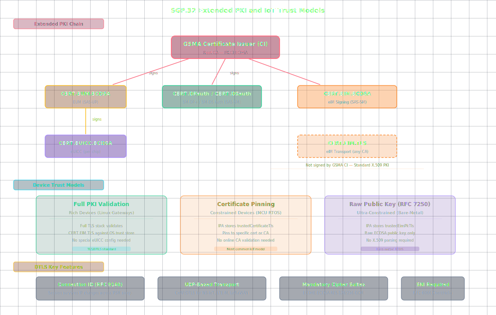

# IoT eSIM Security: eIM Certificates, DTLS, and Device Trust

**🏠 [eUICC.tech]({{ site.baseurl }}/) > [SGP.32 IoT eSIM]({{ site.baseurl }}/docs/articles/sgp32/) > IoT eSIM Security: eIM Certificates, DTLS, and Device Trust**

> **💡 Why this matters:** IoT devices live in hostile environments: remote locations, no physical security, constrained CPUs that can't run full PKI stacks. The IoT eSIM security model extends the consumer PKI with a new `eIM` certificate class, adapts transport security from TLS to DTLS for UDP-based LPWA networks, and introduces three trust models for devices ranging from Linux gateways to bare-metal RTOS sensors.

> **Key takeaways:**
> - New certificate class: `CERT.EIM.ECDSA` (signing) and `CERT.EIM.TLS` (transport) : separate keys, separate purposes
> - Three device trust models: full PKI validation, certificate pinning, raw public key (RFC 7250)
> - DTLS replaces TLS for CoAP/UDP devices; Connection ID (RFC 9146) survives IP changes across PSM sleep cycles
> - Replay protection: per-eIM `counterValue` + `associationToken`; Emergency Profile blocks all eSIM ops during eCall
> - `eIM` must be GSMA SAS-SM certified; private signing key compromise compromises all associated eUICCs

The IoT eSIM security model extends the consumer PKI with a new certificate class: the **`eIM` Certificate** : and adapts transport security for constrained networks. Where consumer devices use TLS over TCP, IoT devices need DTLS over UDP, CoAP instead of HTTP, and certificate pinning for devices that can't validate full PKI chains.



---

## The Extended PKI

SGP.32 adds one new certificate type to the SGP.22 trust chain:

```
                    GSMA Certificate Issuer (CI)
                    │
    ┌───────────────┼───────────────┬──────────────────┐
    │               │               │                  │
    ▼               ▼               ▼                  ▼
EUM Cert       DP/DS Certs      eIM Signing        eIM TLS/DTLS
(CERT.EUM)   (CERT.DPauth,   Certificate         Certificate
              CERT.DSauth)   (CERT.EIM.ECDSA)   (CERT.EIM.TLS)
    │
    ▼
eUICC Cert
(CERT.EUICC)
```

The key distinction: **`CERT.EIM.ECDSA`** is used for signing eUICC Packages (PSMOs and eCOs), while **`CERT.EIM.TLS`** is used for transport security on the `ESipa` interface. They are separate certificates with different key usage extensions.

---

### eIM Signing Certificate (`CERT.EIM.ECDSA`)

Proves the `eIM`'s authority to manage profiles on associated eUICCs. Key constraints:

- **Algorithm:** ECDSA with NIST P-256 (secp256r1) and SHA-256
- **Key usage:** `digitalSignature` only (critical extension)
- **Subject DN:** Must contain `CN=<eIMiD>` : the `eIM`'s unique identifier
- **Extended key usage:** None: this certificate is not for TLS
- **Storage:** The `eIM`'s public key (or certificate) is stored in the eUICC's `EimConfigurationData` during the `addEim` eCO

---

### eIM TLS/DTLS Certificate (`CERT.EIM.TLS`)

Standard X.509 certificate for transport security. Key requirements:

- **Subject DN:** `CN=<eIMiD>`, `C=<country>` (mandatory), optional O/OU/L
- **Key usage:** `digitalSignature` (critical)
- **Extended key usage:** Both `id-kp-serverAuth` AND `id-kp-clientAuth` (critical) : the `eIM` acts as both server and client in mutual TLS
- **SubjectAltName:** Must contain at least one `dNSName` (FQDN) and exactly one `registeredID` (eIM OID)
- **Wildcard:** `dNSName` may use the `*` wildcard as allowed by RFC 2818
- **Issuer:** Any CA: does NOT need to be the GSMA CI (unlike DP/DS/EUICC certs)

This is a departure from consumer RSP: eIM TLS certificates are standard PKI, not GSMA-specific. The eUICC doesn't validate them against the CI root. Instead, the **`trustedPublicKeyDataTls`** in the eIM Configuration Data provides the trust anchor: either a raw public key or a CA certificate that chains to the `eIM`'s TLS certificate.

---

## Trust Models for the IoT Device

IoT devices fall into three categories for eIM trust:

### Full PKI Validation (Rich Devices)

Linux-based IoT gateways with full TLS stacks. The device validates `CERT.EIM.TLS` against its OS trust store. No special configuration needed in the eUICC.

---

### Certificate Pinning (Constrained Devices)

The `IPA` stores `trustedCertificateTls` from the eIM Configuration Data and pins to that specific certificate or CA. No online CA validation required. This is the most common model.

---

### Raw Public Key (Ultra-Constrained Devices)

For devices that can't parse X.509 at all (think bare-metal RTOS sensors), the `IPA` stores `trustedEimPkTls` : just the raw ECDSA public key. DTLS handshake uses raw public key authentication (RFC 7250).

---

## Transport Security: DTLS Enters the Picture

Consumer RSP uses TLS over TCP exclusively. IoT adds DTLS over UDP: critical for CoAP-based LPWA devices.

| Feature | TLS (Consumer IoT) | DTLS (Constrained IoT) |
|---------|-------------------|----------------------|
| Transport | TCP | UDP |
| Handshake | Multi-round-trip | Multi-round-trip (with CID extension) |
| Connection migration | Not supported | Connection ID (RFC 9146) for IP changes |
| Cipher | ECDHE-ECDSA-AES-128-GCM-SHA256 | Same, over DTLS |
| Session resumption | Session tickets (RFC 5077) | Same principle, DTLS-specific |

**Connection ID (CID)** is particularly important for IoT: NB-IoT devices may change IP addresses between PSM wake cycles. Without CID, every wake-up requires a full DTLS handshake. With CID, the session survives IP changes.

---

### TLS/DTLS Requirements

SGP.32 mandates specific cipher suites:

```
TLS_ECDHE_ECDSA_WITH_AES_128_GCM_SHA256     (RFC 5289)
TLS_ECDHE_ECDSA_WITH_AES_256_GCM_SHA384     (RFC 5289)
```

Brainpool curves (RFC 7027) are supported as alternatives to NIST P-256 for jurisdictions requiring non-NIST cryptography.

**Server Name Indication (SNI):** The `ESipa` interface requires SNI (RFC 6066) in the TLS/DTLS ClientHello: the `IPA` MUST include the `eIM`'s hostname. This enables multi-tenant eIM deployments behind a single IP address.

---

## eUICC Security Requirements

The eUICC must:

- Store the **CI Public Key** (`PK.CI.ECDSA`) for verifying SM-DP+ and SM-DS certificates: same as consumer
- Store per-eIM **`EimConfigurationData`** including the `eIM`'s public key or certificate
- Verify **eUICC Package signatures** using the `eIM`'s stored public key before executing any PSMO or eCO
- Maintain per-eIM **counter values** for replay protection
- Generate **association tokens** on demand for anti-replay across eIM re-association
- Reject all eUICC Package operations when the **Emergency Profile** is enabled (eCall active: the device is making an emergency call and profile switching could drop the call)
- Support **eUICC OS Update** : a mechanism for updating the eUICC operating system itself, governed by eUICC eligibility checks performed by the SM-DP+ before any profile download

---

## eIM Security Requirements

The `eIM` (and its operator) must:

- Be GSMA SAS-SM certified (same as SM-DP+)
- Securely store its private signing key (`SK.EIM.ECDSA`) : compromise of this key compromises all associated eUICCs
- Generate fresh per-package counter values
- Verify eUICC Package Result signatures (using `CERT.EUICC.ECDSA`)
- Maintain a secure audit trail of all PSMOs and eCOs

---

## Threats and Mitigations (from SGP.31 Annex A)

SGP.31 includes an informative threats and risks annex. Key threat categories include:

| Threat | Mitigation |
|--------|-----------|
| Compromised IoT Device | eIM Package integrity prevents the device from forging PSMOs |
| Compromised eIM | Certificate revocation via updated `EimConfigurationData` |
| Malicious eIM | eUICC only accepts packages from Associated eIMs with valid signatures |
| Privacy leakage | Profile isolation (ISD-P boundaries); metadata access restricted to ISD-R |
| Profile disable/delete replay | Counter value + association token |
| Cryptographic risks | Minimum key lengths mandated; algorithm agility for post-quantum transition |
| Non-human/unpredictable behaviour | PSMO confirmed by signed eUICC Package Results |

SGP.32 supports algorithm negotiation in the key agreement parameters, allowing future post-quantum algorithms to be introduced without architectural changes.

---

## The Fallback Mechanism

A unique IoT safety feature: the eUICC can automatically enable a **Fallback Profile** if the current operational profile loses connectivity. The fallback profile has its **Fallback Attribute** set via PSMO: typically a provisioning profile from the original equipment manufacturer that provides just enough connectivity to reach the `eIM` for recovery.

The fallback mechanism is triggered by the eUICC autonomously: no eIM involvement needed at trigger time. This is critical for devices deployed in remote locations where a bad profile switch could brick the device permanently.

---

## 📋 Summary

- IoT extends consumer PKI with `CERT.EIM.ECDSA` (signing) and `CERT.EIM.TLS` (transport), each with distinct key usage
- Three trust models (full PKI, certificate pinning, raw public key) accommodate devices from Linux gateways to RTOS sensors
- DTLS with Connection ID (RFC 9146) enables session survival across IP changes on NB-IoT devices
- Fallback Mechanism provides autonomous recovery: the eUICC can revert to a provisioning profile without any server interaction

---

<div align="center">

← Previous: [IoT Profile Download: Direct, Indirect, and eIM Package Handling]({{ site.baseurl }}/docs/articles/sgp32/09-iot-profile-download-packages) · [🏠 Home]({{ site.baseurl }}/)

Next: [eIM Configuration: Associating Remote Managers with Your eUICC]({{ site.baseurl }}/docs/articles/sgp32/11-eim-configuration) →

</div>

---

*Based on GSMA SGP.32 v1.3, Sections 2.6-2.7 and SGP.31 v1.3, Sections 5.2 and Annex A*


---

← Previous: [IoT Profile Download: Direct, Indirect, and eIM Package Handling](09-iot-profile-download-packages) | [Section Index](index) | Next: [eIM Configuration: Associating Remote Managers with Your eUICC](11-eim-configuration) →
