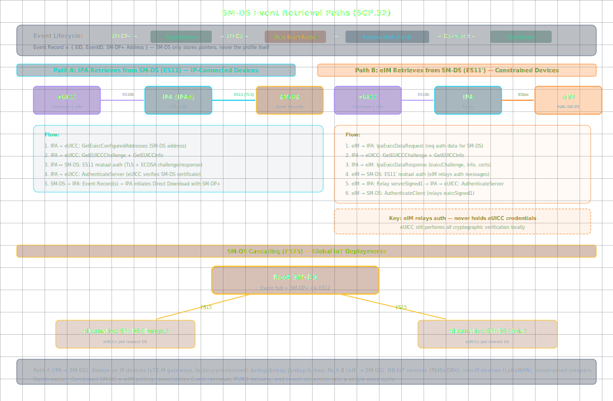

# SM-DS Operations in IoT eSIM: Event Registration and Retrieval

**[eUICC.tech]({{ site.baseurl }}/) > [SGP.32 IoT eSIM]({{ site.baseurl }}/docs/articles/sgp32/) > SM-DS Operations in IoT eSIM: Event Registration and Retrieval**

> **Why this matters:** The SM-DS bridges the gap between "profile is ready" and "device is awake to receive it." In IoT, that gap can span hours, days, or weeks: and the retrieval path can go through either the `IPA` (ES11) or the `eIM` (ES11'). Understanding both paths and when to use each is essential for designing IoT deployments that don't waste airtime on devices that sleep 99% of the time.

> **Key takeaways:**
> - SM-DS stores Event Records (EID + EventID + SM-DP+ address) : unchanged from SGP.22
> - Two retrieval paths: Path A (`IPA` polls SM-DS via ES11) for IP-connected devices, Path B (`eIM` polls via ES11') for constrained devices
> - In Path B, the `eIM` relays authentication messages: the eUICC still performs cryptographic verification; the `eIM` never holds eUICC credentials
> - SM-DS cascading (Root → Alternative SM-DSs via ES15) supports regional deployments, identical to consumer SGP.22
> - Combined SM-DS + eIM polling consolidates Event retrieval, PSMO delivery, and result collection into a single wake cycle

The Subscription Manager Discovery Server (SM-DS) bridges the gap between "profile is ready" and "device is awake to receive it." In IoT, this gap can span hours, days, or weeks: and the retrieval path can go through either the `IPA` or the `eIM`. SGP.32 defines both options.



---

## The SM-DS Role in IoT

The SM-DS is unchanged from SGP.22: it stores Event Records (EID + EventID + SM-DP+ address) and nothing more. But in IoT, how those records are retrieved depends on the device's connectivity model.

---

## Event Lifecycle

```
1. OPERATOR orders Profile → SM-DP+ prepares it
2. SM-DP+ → SM-DS: ES12.RegisterEvent(EID, EventID, SM-DP+ address)
3. SM-DS stores Event Record
4. [Device wakes / eIM polls]
5. Event Record is retrieved (via IPA or eIM)
6. Device downloads Profile from SM-DP+
7. SM-DP+ → SM-DS: ES12.DeleteEvent(EID, EventID)
```

---

## Two Retrieval Paths

### Path A: IPA Retrieves from SM-DS (`ES11`)

The `IPA` connects directly to the SM-DS. This requires the IoT device to have IP connectivity to the SM-DS: suitable for devices with full internet access.

```
IPA → eUICC: ES10a.GetEuiccConfiguredAddresses (get SM-DS address)
IPA → eUICC: ES10b.GetEUICCChallenge (for mutual auth)
IPA → eUICC: ES10b.GetEUICCInfo (euiccInfo1 for auth context)

IPA ↔ SM-DS: ES11 secure connection (TLS or DTLS)

IPA → SM-DS: ES11.InitiateAuthentication
SM-DS → IPA: serverSigned1, serverSignature1, CERT.DSauth.ECDSA
IPA → eUICC: ES10b.AuthenticateServer → eUICC verifies DS cert
IPA → SM-DS: ES11.AuthenticateClient

SM-DS → IPA: Event Record(s)

IPA: Parse SM-DP+ address from Event Record
 → Initiate Direct Profile Download with SM-DP+
```

---

### Path B: eIM Retrieves from SM-DS (`ES11'`)

The `eIM` polls the SM-DS on behalf of the device. This is the preferred path for constrained devices: the airtime cost of SM-DS polling is offloaded to the `eIM`'s server-side infrastructure.

```
IPA ↔ eIM: ESipa secure connection established
eIM → IPA: IpaEuiccDataRequest (request mutual auth info for SM-DS)

IPA → eUICC: ES10b.GetEUICCChallenge
IPA → eUICC: ES10b.GetEUICCInfo
IPA → eIM: IpaEuiccDataResponse (euiccChallenge, euiccInfo1, certificates)

eIM ↔ SM-DS: ES11' secure connection
eIM → SM-DS: ES11'.InitiateAuthentication (relaying eUICC data)
SM-DS → eIM: serverSigned1, serverSignature1, CERT.DSauth.ECDSA
eIM → IPA: ESipa message containing serverAuth data
IPA → eUICC: ES10b.AuthenticateServer → eUICC verifies
IPA → eIM: ESipa message containing euiccSigned1, euiccSignature1
eIM → SM-DS: ES11'.AuthenticateClient

SM-DS → eIM: Event Record
eIM → IPA: Forward Event Record via ESipa

IPA: Parse SM-DP+ address
 → Initiate Direct Profile Download with SM-DP+
```

**Key difference from Path A:** The mutual authentication still involves the eUICC cryptographically: the `eIM` cannot authenticate on behalf of the eUICC. The `eIM` merely relays the authentication messages between the two endpoints, re-encoding them for the two different secure connections (`ESipa` and `ES11'`). This is message proxying, not credential sharing.

---

## SM-DS Cascading

For global IoT deployments, a single SM-DS is a bottleneck:

```
Root SM-DS ← ES12 ← SM-DP+ (registers Event)
 ↓ ES15
Alternative SM-DS 1 (Europe) Alternative SM-DS 2 (Asia)
 ↑ ES11/ES11' ↑ ES11/ES11'
 IPA/eIM IPA/eIM
```

The Root SM-DS propagates events to regional Alternative SM-DSs via ES15. Devices poll the nearest SM-DS based on their configured address. This is identical to consumer SGP.22 cascading.

---

## Event Deletion

After a profile is successfully downloaded and installed:

```
SM-DP+ → SM-DS: ES12.DeleteEvent(EID, EventID)
SM-DS: Removes Event Record

If cascaded:
 SM-DS → Alternative SM-DS: ES15.DeleteEvent(EID, EventID)
```

The SM-DS must also handle stale events: events for profiles that were cancelled or expired. The deletion is initiated by the SM-DP+; the SM-DS never autonomously removes events.

---

## When to Use Each Path

| Device Type | Preferred Path | Reason |
|-------------|---------------|--------|
| NB-IoT sensor (PSM, eDRX) | Path B (`eIM`) | Device sleeps most of the time; `eIM` polls on wake |
| LTE-M gateway (always-on) | Path A (`IPA`) | Device has IP connectivity and power budget for direct polling |
| Non-IP device (LoRaWAN) | Path B (`eIM`) | Can't reach SM-DS directly at all |
| Factory-provisioned gateway | Path A (`IPA`) | Initial boot has full connectivity before constrained deployment |
| Automotive module | Either | Depends on whether the TCU maintains its own IP connection |

---

## SM-DS Address Configuration

The `IPA` can retrieve and configure SM-DS addresses:

```
IPA → eUICC: ES10a.GetEuiccConfiguredAddresses
Returns:
 - defaultDpAddress (default SM-DP+)
 - rootDsAddress (Root SM-DS)

IPA → eUICC: ES10a.SetDefaultDpAddress(newAddress)
 Subset of SGP.22 ES10a functionality preserved for IoT
```

The Root SM-DS address is typically configured during manufacturing and rarely changes.

---

## Optimisation: Combined SM-DS + eIM Polling

A common IoT optimisation: the `eIM` integrates SM-DS Event retrieval into its regular `IpaEuiccDataRequest` cycle. When the device wakes and checks in with the `eIM`, the `eIM` simultaneously:

1. Retrieves pending eUICC Package Results
2. Delivers any new eUICC Packages (PSMOs/eCOs)
3. Checks SM-DS for pending Event Records
4. Returns Profile Download Triggers if events found

This consolidates what would be three separate exchanges into one wake cycle: critical for battery-powered devices where every radio transmission costs measurable lifetime.

---

## Summary

- Two retrieval paths exist: Path A (`IPA` → SM-DS via ES11) for IP-connected devices, Path B (`eIM` → SM-DS via ES11') for constrained devices
- In Path B, the `eIM` relays authentication messages but never holds eUICC credentials: the eUICC still performs cryptographic verification
- SM-DS cascading via ES15 supports global deployments with regional Alternative SM-DSs
- Combined SM-DS + eIM polling consolidates multiple exchanges into a single wake cycle, critical for battery life

---

<div align="center">

← Previous: <a href="{{ site.baseurl }}/docs/articles/sgp32/14-iot-profile-state-management">Profile State Management via the eIM: Remote Enable, Disable, Delete</a> · <a href="{{ site.baseurl }}/">Home</a>

Next: <a href="{{ site.baseurl }}/docs/articles/sgp32/16-iot-functions-reference">IoT eSIM Functions Reference: ESipa, ES9+', ES11', ESep</a> →

</div>

---

*Based on GSMA SGP.32 v1.3, Section 3.9*


---

← Previous: [Profile State Management via the eIM: Remote Enable, Disable, Delete](14-iot-profile-state-management) | [Section Index](index) | Next: [IoT eSIM Functions Reference: ESipa, ES9+', ES11', ESep](16-iot-functions-reference) →
